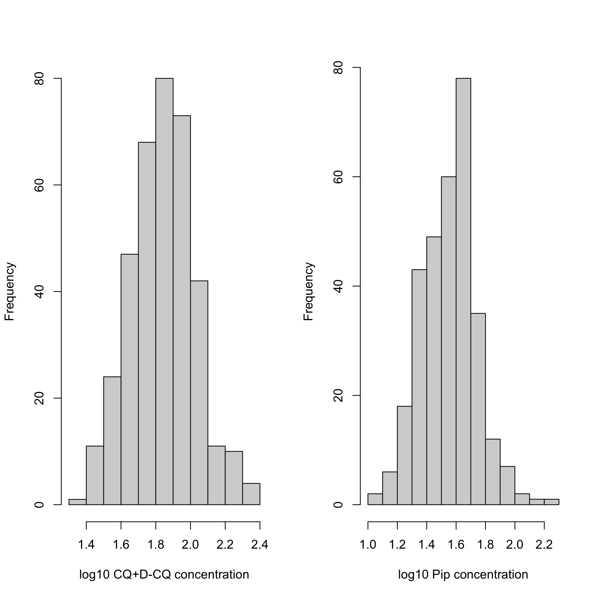
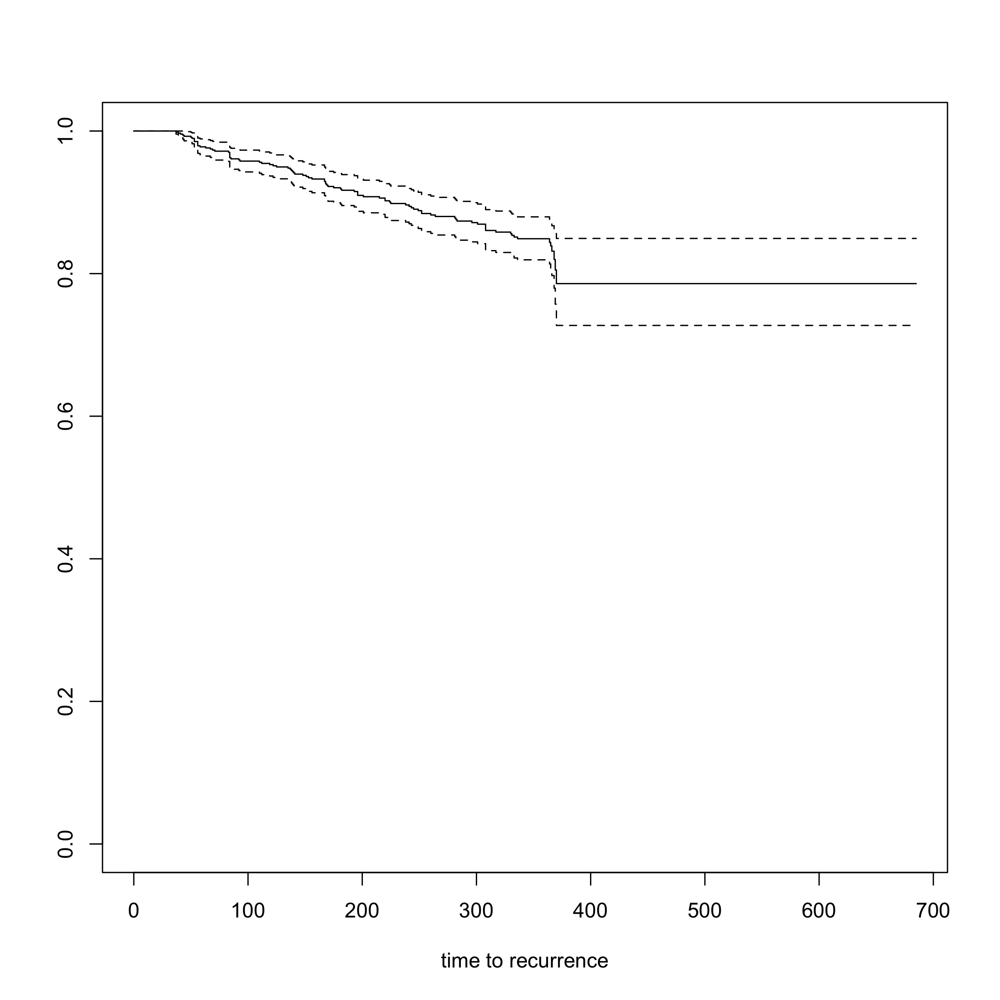

```r
library(mgcv)
```

```
## Loading required package: nlme
```

```
## This is mgcv 1.8-33. For overview type 'help("mgcv-package")'.
```

```r
library(survival)
sessionInfo()
```

```
## R version 4.0.2 (2020-06-22)
## Platform: x86_64-apple-darwin17.0 (64-bit)
## Running under: macOS  10.16
## 
## Matrix products: default
## BLAS:   /Library/Frameworks/R.framework/Versions/4.0/Resources/lib/libRblas.dylib
## LAPACK: /Library/Frameworks/R.framework/Versions/4.0/Resources/lib/libRlapack.dylib
## 
## locale:
## [1] en_GB.UTF-8/en_GB.UTF-8/en_GB.UTF-8/C/en_GB.UTF-8/en_GB.UTF-8
## 
## attached base packages:
## [1] stats     graphics  grDevices utils     datasets  methods   base     
## 
## other attached packages:
## [1] survival_3.2-7 mgcv_1.8-33    nlme_3.1-152  
## 
## loaded via a namespace (and not attached):
##  [1] lattice_0.20-41   digest_0.6.27     grid_4.0.2        magrittr_2.0.1   
##  [5] evaluate_0.14     rlang_0.4.10      stringi_1.5.3     Matrix_1.3-2     
##  [9] rmarkdown_2.6     splines_4.0.2     tools_4.0.2       stringr_1.4.0    
## [13] xfun_0.20         yaml_2.2.1        compiler_4.0.2    htmltools_0.5.1.1
## [17] knitr_1.31
```


```r
pmq_PK = read.csv('BPD_curated.csv')
Combined_Time_Data = read.csv('Time_to_event.csv')
cols = RColorBrewer::brewer.pal(n = 3, name = 'Dark2')

writeLines(sprintf('There are a total of %s unique patients with data', length(unique(pmq_PK$patientid))))
```

```
## There are a total of 641 unique patients with data
```

```r
sum(is.na(pmq_PK$pk_cpmq) & is.na(pmq_PK$pk_pmq))
```

```
## [1] 0
```

```r
sum(!is.na(pmq_PK$pk_pip) | !is.na(pmq_PK$pk_cq))
```

```
## [1] 692
```

```r
# Patients who stopped before day 7
id_stopped = c(131, # last dose day 4
               301, # last dose day 5
               379, # last dose day 5
               397, # last dose day 5
               627) # last dose day 5
which(id_stopped %in% pmq_PK$patientid)
```

```
## [1] 2 3 5
```

```r
ind_rm = pmq_PK$patientid %in% id_stopped
writeLines(sprintf('We remove %s data points from %s patients',
                   sum(ind_rm), length(id_stopped)))
```

```
## We remove 3 data points from 5 patients
```

```r
pmq_PK = pmq_PK[!ind_rm, ]

writeLines(sprintf('Analysing a total of %s data points from %s patients',
                   nrow(pmq_PK), sum(!duplicated(pmq_PK$patientid))))
```

```
## Analysing a total of 717 data points from 638 patients
```


```r
par(las=1, mfrow=c(1,2))
plot(pmq_PK$age, pmq_PK$dailypmqdose,xlab='Age (years)', 
     ylab='Daily dose (mg)',
     col = pmq_PK$high_dose+1)
plot(pmq_PK$age, pmq_PK$mgkgdose,
     xlab='Age (years)', ylab='Daily dose (mg/kg)', col = pmq_PK$high_dose+1)
```

<!-- -->

```r
sum(!duplicated(pmq_PK$patientid))
```

```
## [1] 638
```

```r
table(pmq_PK$age[!duplicated(pmq_PK$patientid)]<=10)
```

```
## 
## FALSE  TRUE 
##   534   104
```

```r
table(pmq_PK$age[!duplicated(pmq_PK$patientid)]<=5)
```

```
## 
## FALSE  TRUE 
##   605    33
```

fit models

```r
pmq_PK$ratio=log10(pmq_PK$pk_cpmq)-log10(pmq_PK$pk_pmq)
pmq_PK$patientid = as.factor(pmq_PK$patientid)

mod_ratio = gam(ratio ~ s(log10(age), k=3)+
                  mgkgdose+partner_drug+daysonpq+fct+
                  s(patientid, bs = 're'), 
                data = pmq_PK)
mod_pmq = gam(log10(pk_pmq) ~ s(log10(age), k=3)+
                mgkgdose+partner_drug+daysonpq+fct+
                s(patientid, bs = 're'), 
              data = pmq_PK)
mod_cpmq = gam(log10(pk_cpmq) ~ s(log10(age), k=3)+
                 mgkgdose+partner_drug+daysonpq+fct+
                 s(patientid, bs = 're'), 
               data = pmq_PK)
```


```r
par(las=1, mfrow=c(2,2), family='serif', cex.lab=1.3, cex.axis=1.3)
plot(log10(pmq_PK$age), pmq_PK$mgkgdose,panel.first=grid(),
     xlab='Age (years)', ylab='Daily dose (mg/kg)',xaxt='n',
     col = cols[pmq_PK$partner_drug+1])
mtext(text = 'A', side = 3, adj = 0, line=2, cex=1.5)
axis(1, at = log10(c(1.5,3,10,30)), labels = c(1.5,3,10,30))
legend('topleft', col=cols[1:2], pch=1,
       legend = c('DHA-piperaquine','Chloroquine'), inset = 0.06)
points(log10(pmq_PK$age), pmq_PK$mgkgdose,
       col = cols[pmq_PK$partner_drug+1])

plot(log10(pmq_PK$age), log10(pmq_PK$pk_pmq), 
     col = cols[pmq_PK$partner_drug+1], xlab='Age (years)', 
     ylab = 'Primaquine (ng/mL)', yaxt='n',
     panel.first=grid(), xaxt='n')
axis(2, at = seq(0,2.5, length.out = 5), 
     labels = round(10^seq(0,2.5, length.out = 5)))
axis(1, at = log10(c(1.5,3,10,30)), labels = c(1.5,3,10,30))
mtext(text = 'B', side = 3, adj = 0, line=2, cex=1.5)

summary(mod_pmq)
```

```
## 
## Family: gaussian 
## Link function: identity 
## 
## Formula:
## log10(pk_pmq) ~ s(log10(age), k = 3) + mgkgdose + partner_drug + 
##     daysonpq + fct + s(patientid, bs = "re")
## 
## Parametric coefficients:
##              Estimate Std. Error t value Pr(>|t|)    
## (Intercept)  -0.06443    0.07021  -0.918    0.359    
## mgkgdose      1.14532    0.06034  18.983   <2e-16 ***
## partner_drug  0.01405    0.03099   0.453    0.650    
## daysonpq      0.03820    0.04744   0.805    0.421    
## fct          -0.01698    0.02114  -0.803    0.422    
## ---
## Signif. codes:  0 '***' 0.001 '**' 0.01 '*' 0.05 '.' 0.1 ' ' 1
## 
## Approximate significance of smooth terms:
##                  edf  Ref.df      F p-value    
## s(log10(age))  1.554   1.762 28.047  <2e-16 ***
## s(patientid)  89.107 633.000  0.168  0.0144 *  
## ---
## Signif. codes:  0 '***' 0.001 '**' 0.01 '*' 0.05 '.' 0.1 ' ' 1
## 
## R-sq.(adj) =  0.452   Deviance explained = 52.4%
## GCV = 0.1665  Scale est. = 0.14428   n = 717
```

```r
lines(log10(1:60), predict(mod_pmq,
                           data.frame(age=1:60,mgkgdose=0.5,
                                      partner_drug=1,
                                      daysonpq=1,fct=0,
                                      patientid=0),
                           exclude = "s(patientid)"),
      lwd=3)
```

```
## Warning in predict.gam(mod_pmq, data.frame(age = 1:60, mgkgdose = 0.5,
## partner_drug = 1, : factor levels 0 not in original fit
```

```r
lines(log10(1:60), predict(mod_pmq,
                           data.frame(age=1:60,mgkgdose=1,
                                      partner_drug=1,
                                      daysonpq=1,fct=0,
                                      patientid=0),
                           exclude = "s(patientid)"),
      lwd=3, lty=2)
```

```
## Warning in predict.gam(mod_pmq, data.frame(age = 1:60, mgkgdose = 1,
## partner_drug = 1, : factor levels 0 not in original fit
```

```r
plot(log10(pmq_PK$age), log10(pmq_PK$pk_cpmq), 
     col = cols[pmq_PK$partner_drug+1], xlab='Age (years)', 
     ylab = 'Carboxyprimaquine (ng/mL)', yaxt='n',
     panel.first=grid(), xaxt='n')
axis(2, at = seq(1,3.5, length.out = 5), 
     labels = round(10^seq(1,3.5, length.out = 5)))
axis(1, at = log10(c(1.5,3,10,30)), labels = c(1.5,3,10,30))
mtext(text = 'C', side = 3, adj = 0, line=2, cex=1.5)


summary(mod_cpmq)
```

```
## 
## Family: gaussian 
## Link function: identity 
## 
## Formula:
## log10(pk_cpmq) ~ s(log10(age), k = 3) + mgkgdose + partner_drug + 
##     daysonpq + fct + s(patientid, bs = "re")
## 
## Parametric coefficients:
##              Estimate Std. Error t value Pr(>|t|)    
## (Intercept)   2.16133    0.04758  45.422   <2e-16 ***
## mgkgdose      0.85206    0.03988  21.366   <2e-16 ***
## partner_drug -0.01957    0.02113  -0.926    0.355    
## daysonpq      0.04151    0.03247   1.278    0.202    
## fct          -0.02710    0.01443  -1.878    0.061 .  
## ---
## Signif. codes:  0 '***' 0.001 '**' 0.01 '*' 0.05 '.' 0.1 ' ' 1
## 
## Approximate significance of smooth terms:
##                  edf Ref.df      F p-value    
## s(log10(age))   1.89   1.95 70.599  <2e-16 ***
## s(patientid)  234.89 633.00  0.634  <2e-16 ***
## ---
## Signif. codes:  0 '***' 0.001 '**' 0.01 '*' 0.05 '.' 0.1 ' ' 1
## 
## R-sq.(adj) =  0.666   Deviance explained = 77.8%
## GCV = 0.072746  Scale est. = 0.048215  n = 717
```

```r
lines(log10(1:60), predict(mod_cpmq,
                           data.frame(age=1:60,mgkgdose=0.5,
                                      partner_drug=1,
                                      daysonpq=1,fct=0,
                                      patientid=0),
                           exclude = "s(patientid)"),
      lwd=3)
```

```
## Warning in predict.gam(mod_cpmq, data.frame(age = 1:60, mgkgdose = 0.5, : factor
## levels 0 not in original fit
```

```r
predict(mod_cpmq, data.frame(age=c(5,30),
                             mgkgdose=0.5,
                             partner_drug=1,
                             daysonpq=1,fct=0,
                             patientid=0),
        exclude = "s(patientid)")
```

```
## Warning in predict.gam(mod_cpmq, data.frame(age = c(5, 30), mgkgdose = 0.5, :
## factor levels 0 not in original fit
```

```
##        1        2 
## 2.333145 2.695475
```

```r
predict(mod_pmq, data.frame(age=c(5,30),
                            mgkgdose=0.5,
                            partner_drug=1,
                            daysonpq=1,fct=0,
                            patientid=0),
        exclude = "s(patientid)")
```

```
## Warning in predict.gam(mod_pmq, data.frame(age = c(5, 30), mgkgdose = 0.5, :
## factor levels 0 not in original fit
```

```
##         1         2 
## 0.3739908 0.6312653
```

```r
lines(log10(1:60), predict(mod_cpmq,
                           data.frame(age=1:60,mgkgdose=1,
                                      partner_drug=1,
                                      daysonpq=1,fct=0,
                                      patientid=0),
                           exclude = "s(patientid)"),
      lwd=3, lty=2)
```

```
## Warning in predict.gam(mod_cpmq, data.frame(age = 1:60, mgkgdose = 1,
## partner_drug = 1, : factor levels 0 not in original fit
```

```r
## Ratio
plot(log10(pmq_PK$age), pmq_PK$ratio,
     panel.first=grid(),yaxt='n',xaxt='n',
     xlab='Age (years)', ylab='Carboxyprimaquine/Primaquine ratio',
     col = cols[pmq_PK$partner_drug+1])
axis(2, at =  seq(0.5,2.5, length.out = 6), 
     labels = round(10^seq(0.5,2.5, length.out = 6)))
axis(1, at = log10(c(1.5,3,10,30)), labels = c(1.5,3,10,30))
mtext(text = 'D', side = 3, adj = 0,line = 2, cex=1.5)

summary(mod_ratio)
```

```
## 
## Family: gaussian 
## Link function: identity 
## 
## Formula:
## ratio ~ s(log10(age), k = 3) + mgkgdose + partner_drug + daysonpq + 
##     fct + s(patientid, bs = "re")
## 
## Parametric coefficients:
##               Estimate Std. Error t value Pr(>|t|)    
## (Intercept)   2.226736   0.051248  43.451  < 2e-16 ***
## mgkgdose     -0.281486   0.043184  -6.518 1.73e-10 ***
## partner_drug -0.038602   0.022723  -1.699    0.090 .  
## daysonpq     -0.004026   0.034894  -0.115    0.908    
## fct          -0.008603   0.015519  -0.554    0.580    
## ---
## Signif. codes:  0 '***' 0.001 '**' 0.01 '*' 0.05 '.' 0.1 ' ' 1
## 
## Approximate significance of smooth terms:
##                   edf  Ref.df      F  p-value    
## s(log10(age))   1.901   1.959 10.426 2.83e-05 ***
## s(patientid)  206.497 633.000  0.524  < 2e-16 ***
## ---
## Signif. codes:  0 '***' 0.001 '**' 0.01 '*' 0.05 '.' 0.1 ' ' 1
## 
## R-sq.(adj) =   0.38   Deviance explained = 56.4%
## GCV = 0.085316  Scale est. = 0.059923  n = 717
```

```r
lines(log10(1:60), predict(mod_ratio,
                           data.frame(age=1:60,mgkgdose=0.5,
                                      partner_drug=1,
                                      daysonpq=1,fct=0,
                                      patientid=0),
                           exclude = "s(patientid)"),
      lwd=3)
```

```
## Warning in predict.gam(mod_ratio, data.frame(age = 1:60, mgkgdose = 0.5, :
## factor levels 0 not in original fit
```

```r
lines(log10(1:60), predict(mod_ratio,
                           data.frame(age=1:60,mgkgdose=1,
                                      partner_drug=1,
                                      daysonpq=1,fct=0,
                                      patientid=0),
                           exclude = "s(patientid)"),
      lwd=3, lty=2)
```

```
## Warning in predict.gam(mod_ratio, data.frame(age = 1:60, mgkgdose = 1,
## partner_drug = 1, : factor levels 0 not in original fit
```

<!-- -->


Numbers for precise comparisons

```r
out1=predict(mod_cpmq,data.frame(age=c(5,30),mgkgdose=1,
                                      partner_drug=1,
                                      daysonpq=1,fct=0,
                                      patientid=0),
                           exclude = "s(patientid)", se.fit = T)
```

```
## Warning in predict.gam(mod_cpmq, data.frame(age = c(5, 30), mgkgdose = 1, :
## factor levels 0 not in original fit
```

```r
10^(out1$fit[1])/10^(out1$fit[2])
```

```
##         1 
## 0.4341811
```

```r
10^(out1$fit[1]+1.96*out1$se.fit[1])/10^(out1$fit[2]-1.96*out1$se.fit[2])
```

```
##         1 
## 0.5516242
```

```r
10^(out1$fit[1]-1.96*out1$se.fit[1])/10^(out1$fit[2]+1.96*out1$se.fit[2])
```

```
##         1 
## 0.3417421
```

```r
out1=predict(mod_pmq,data.frame(age=c(5,30),mgkgdose=1,
                                      partner_drug=1,
                                      daysonpq=1,fct=0,
                                      patientid=0),
                           exclude = "s(patientid)",se.fit = T)
```

```
## Warning in predict.gam(mod_pmq, data.frame(age = c(5, 30), mgkgdose = 1, :
## factor levels 0 not in original fit
```

```r
10^(out1$fit[1])/10^(out1$fit[2])
```

```
##         1 
## 0.5530004
```

```r
10^(out1$fit[1]+1.96*out1$se.fit[1])/10^(out1$fit[2]-1.96*out1$se.fit[2])
```

```
##        1 
## 0.782286
```

```r
10^(out1$fit[1]-1.96*out1$se.fit[1])/10^(out1$fit[2]+1.96*out1$se.fit[2])
```

```
##         1 
## 0.3909177
```


```r
pmq_PK$log10_CQ[which(pmq_PK$log10_CQ<1)] = NA
pmq_PK$log10_Pip[which(pmq_PK$log10_Pip<1)] = NA

par(mfrow=c(1,2))
hist(pmq_PK$log10_CQ, xlab='log10 CQ+D-CQ concentration',main='')
hist(pmq_PK$log10_Pip, xlab='log10 Pip concentration',main='')
```

<!-- -->

```r
# effect of chloroquine
mod_pmq_CQ = gam(log10(pk_pmq) ~ s(log10(age), k=3)+
                   mgkgdose+daysonpq+fct+log10_CQ+
                   s(patientid, bs = 're'), 
                 data = pmq_PK)
xx = summary(mod_pmq_CQ)
10^xx$p.coeff['log10_CQ']
```

```
## log10_CQ 
## 2.197435
```

```r
round(10^(xx$p.coeff['log10_CQ'] + c(-1,1)*xx$se['log10_CQ']),1)
```

```
## [1] 1.7 2.9
```

```r
xx$p.pv['log10_CQ']
```

```
##    log10_CQ 
## 0.005083256
```

```r
mod_cpmq_CQ = gam(log10(pk_cpmq) ~ s(log10(age), k=3)+
                    mgkgdose+daysonpq+fct+log10_CQ+
                    s(patientid, bs = 're'), 
                  data = pmq_PK)
xx = summary(mod_cpmq_CQ)
10^xx$p.coeff['log10_CQ']
```

```
## log10_CQ 
## 1.932238
```

```r
round(10^(xx$p.coeff['log10_CQ'] + c(-1,1)*xx$se['log10_CQ']),1)
```

```
## [1] 1.6 2.3
```

```r
xx$p.pv['log10_CQ']
```

```
##     log10_CQ 
## 0.0003661564
```

```r
mod_ratio_CQ = gam(ratio ~ s(log10(age), k=3)+
                     mgkgdose+daysonpq+fct+log10_CQ+
                     s(patientid, bs = 're'), 
                   data = pmq_PK)
xx = summary(mod_ratio_CQ)
10^xx$p.coeff['log10_CQ']
```

```
##  log10_CQ 
## 0.8691444
```

```r
round(10^(xx$p.coeff['log10_CQ'] + c(-1,1)*xx$se['log10_CQ']),1)
```

```
## [1] 0.7 1.1
```

```r
xx$p.pv['log10_CQ']
```

```
##  log10_CQ 
## 0.4958218
```

```r
# effect of piperaquine
mod_pmq_Pip = gam(log10(pk_pmq) ~ s(log10(age), k=3)+
                    mgkgdose+daysonpq+fct+log10_Pip, 
                  data = pmq_PK)
xx = summary(mod_pmq_Pip)
10^xx$p.coeff['log10_Pip']
```

```
## log10_Pip 
##  2.663538
```

```r
round(10^(xx$p.coeff['log10_Pip'] + c(-1,1)*xx$se['log10_Pip']),1)
```

```
## [1] 2.0 3.6
```

```r
xx$p.pv['log10_Pip']
```

```
##    log10_Pip 
## 0.0008034345
```

```r
mod_cpmq_Pip = gam(log10(pk_cpmq) ~ s(log10(age), k=3)+
                     mgkgdose+daysonpq+fct+log10_Pip, 
                   data = pmq_PK)
xx = summary(mod_cpmq_Pip)
10^xx$p.coeff['log10_Pip']
```

```
## log10_Pip 
##  2.689215
```

```r
round(10^(xx$p.coeff['log10_Pip'] + c(-1,1)*xx$se['log10_Pip']),1)
```

```
## [1] 2.2 3.3
```

```r
xx$p.pv['log10_Pip']
```

```
##    log10_Pip 
## 4.616585e-07
```

```r
mod_ratio_Pip = gam(ratio ~ s(log10(age), k=3)+
                      mgkgdose+daysonpq+fct+log10_Pip, 
                    data = pmq_PK)
summary(mod_ratio_Pip)
```

```
## 
## Family: gaussian 
## Link function: identity 
## 
## Formula:
## ratio ~ s(log10(age), k = 3) + mgkgdose + daysonpq + fct + log10_Pip
## 
## Parametric coefficients:
##              Estimate Std. Error t value Pr(>|t|)    
## (Intercept)  2.257024   0.160476  14.065  < 2e-16 ***
## mgkgdose    -0.392023   0.067432  -5.814 1.53e-08 ***
## daysonpq     0.014141   0.052276   0.271    0.787    
## fct         -0.017030   0.027440  -0.621    0.535    
## log10_Pip   -0.005155   0.091246  -0.056    0.955    
## ---
## Signif. codes:  0 '***' 0.001 '**' 0.01 '*' 0.05 '.' 0.1 ' ' 1
## 
## Approximate significance of smooth terms:
##                 edf Ref.df     F p-value   
## s(log10(age)) 1.888  1.988 5.307 0.00406 **
## ---
## Signif. codes:  0 '***' 0.001 '**' 0.01 '*' 0.05 '.' 0.1 ' ' 1
## 
## R-sq.(adj) =  0.114   Deviance explained =   13%
## GCV = 0.092202  Scale est. = 0.090179  n = 314
```


Plot against residuals******

```r
ind = !is.na(pmq_PK$ASscore)
sum(!duplicated(pmq_PK$patientid) & ind)
```

```
## [1] 154
```

```r
table(pmq_PK$ASscore[!duplicated(pmq_PK$patientid)])
```

```
## 
##    0 0.25  0.5    1 1.25    2 
##    3   19   17   22   64   29
```

```r
pmq_PK$pred_pmq[!is.na(pmq_PK$pk_pmq)] = predict(mod_pmq)
pmq_PK$res_pmq = log10(pmq_PK$pk_pmq)-pmq_PK$pred_pmq

pmq_PK$pred_cpmq[!is.na(pmq_PK$pk_cpmq)] = predict(mod_cpmq)
pmq_PK$res_cpmq = log10(pmq_PK$pk_cpmq)-pmq_PK$pred_cpmq

par(mfrow=c(1,2), las=1, family='serif', 
    cex.axis=1.3, cex.lab=1.3)
plot(jitter(pmq_PK$ASscore,amount = .03), 
     pmq_PK$res_pmq,xlab='CYP 2D6 activity score',
     panel.first=grid(),
     ylab='Model residual (primaquine)')
abline(h=0, lty=2, lwd=2)
modAS_res_pmq = lm(res_pmq ~ ASscore,
                   data = pmq_PK)
abline(modAS_res_pmq,lwd=3)
summary(modAS_res_pmq)
```

```
## 
## Call:
## lm(formula = res_pmq ~ ASscore, data = pmq_PK)
## 
## Residuals:
##      Min       1Q   Median       3Q      Max 
## -1.13583 -0.21882 -0.01576  0.19175  1.30549 
## 
## Coefficients:
##             Estimate Std. Error t value Pr(>|t|)   
## (Intercept)  0.13557    0.04974   2.726  0.00691 **
## ASscore     -0.12471    0.03993  -3.124  0.00202 **
## ---
## Signif. codes:  0 '***' 0.001 '**' 0.01 '*' 0.05 '.' 0.1 ' ' 1
## 
## Residual standard error: 0.3401 on 229 degrees of freedom
##   (486 observations deleted due to missingness)
## Multiple R-squared:  0.04087,	Adjusted R-squared:  0.03668 
## F-statistic: 9.757 on 1 and 229 DF,  p-value: 0.002017
```

```r
plot(jitter(pmq_PK$ASscore,amount = .03), 
     pmq_PK$res_cpmq,xlab='CYP 2D6 activity score',
     panel.first=grid(),
     ylab='Model residual (carboxyprimaquine)')
abline(h=0, lty=2, lwd=2)
modAS_res_cpmq = lm(res_cpmq ~ ASscore,data = pmq_PK)
abline(modAS_res_cpmq,lwd=3)
```

<!-- -->

```r
summary(modAS_res_cpmq)
```

```
## 
## Call:
## lm(formula = res_cpmq ~ ASscore, data = pmq_PK)
## 
## Residuals:
##      Min       1Q   Median       3Q      Max 
## -0.91453 -0.08027  0.03566  0.10911  0.38456 
## 
## Coefficients:
##             Estimate Std. Error t value Pr(>|t|)
## (Intercept)  0.03590    0.02579   1.392    0.165
## ASscore     -0.03187    0.02071  -1.539    0.125
## 
## Residual standard error: 0.1764 on 229 degrees of freedom
##   (486 observations deleted due to missingness)
## Multiple R-squared:  0.01024,	Adjusted R-squared:  0.005918 
## F-statistic: 2.369 on 1 and 229 DF,  p-value: 0.1251
```


## Met-Hb versus age


```r
mod_methb = gam(methb ~ s(log10(age),k=3)+
                  mgkgdose+daysonpq+G6PDdef, 
                data = pmq_PK)
xx=summary(mod_methb)
xx$s.pv
```

```
## [1] 0
```

```r
out1=predict(mod_methb,data.frame(age=c(5,30),mgkgdose=1,
                                      daysonpq=1,G6PDdef=1,
                                      patientid=0),
                           exclude = "s(patientid)",se.fit = T)
(out1$fit[1])/(out1$fit[2])
```

```
##         1 
## 0.8693579
```

```r
(out1$fit[1]+1.96*out1$se.fit[1])/(out1$fit[2]-1.96*out1$se.fit[2])
```

```
##        1 
## 1.270195
```

```r
(out1$fit[1]-1.96*out1$se.fit[1])/(out1$fit[2]+1.96*out1$se.fit[2])
```

```
##         1 
## 0.5845148
```

```r
mod_methb2 = gam(methb ~ s(log10(age), k=3)+
                   mgkgdose+daysonpq+ASscore+G6PDdef, 
                 data = pmq_PK)
summary(mod_methb2)
```

```
## 
## Family: gaussian 
## Link function: identity 
## 
## Formula:
## methb ~ s(log10(age), k = 3) + mgkgdose + daysonpq + ASscore + 
##     G6PDdef
## 
## Parametric coefficients:
##             Estimate Std. Error t value Pr(>|t|)    
## (Intercept)   4.1867     1.3424   3.119 0.002250 ** 
## mgkgdose      3.1357     0.9173   3.419 0.000849 ***
## daysonpq     -1.1144     0.7657  -1.456 0.148008    
## ASscore       0.6595     0.4367   1.510 0.133495    
## G6PDdef      -0.7631     0.8712  -0.876 0.382736    
## ---
## Signif. codes:  0 '***' 0.001 '**' 0.01 '*' 0.05 '.' 0.1 ' ' 1
## 
## Approximate significance of smooth terms:
##                 edf Ref.df    F  p-value    
## s(log10(age)) 1.947  1.997 9.05 0.000216 ***
## ---
## Signif. codes:  0 '***' 0.001 '**' 0.01 '*' 0.05 '.' 0.1 ' ' 1
## 
## R-sq.(adj) =  0.202   Deviance explained = 23.8%
## GCV = 7.7766  Scale est. = 7.3703    n = 133
```

```r
mod_methb3 = gam(methb ~ s(log10(age), k=3)+
                   mgkgdose+as.numeric(ASscore<=0.5)+G6PDdef, 
                 data = pmq_PK)
summary(mod_methb3)
```

```
## 
## Family: gaussian 
## Link function: identity 
## 
## Formula:
## methb ~ s(log10(age), k = 3) + mgkgdose + as.numeric(ASscore <= 
##     0.5) + G6PDdef
## 
## Parametric coefficients:
##                            Estimate Std. Error t value Pr(>|t|)    
## (Intercept)                  3.7161     0.7212   5.152 9.56e-07 ***
## mgkgdose                     3.4396     0.9164   3.754 0.000264 ***
## as.numeric(ASscore <= 0.5)  -1.2093     0.5855  -2.065 0.040923 *  
## G6PDdef                     -0.4339     0.8574  -0.506 0.613664    
## ---
## Signif. codes:  0 '***' 0.001 '**' 0.01 '*' 0.05 '.' 0.1 ' ' 1
## 
## Approximate significance of smooth terms:
##                 edf Ref.df     F  p-value    
## s(log10(age)) 1.943  1.997 8.346 0.000448 ***
## ---
## Signif. codes:  0 '***' 0.001 '**' 0.01 '*' 0.05 '.' 0.1 ' ' 1
## 
## R-sq.(adj) =  0.202   Deviance explained = 23.2%
## GCV = 7.7081  Scale est. = 7.3637    n = 133
```

```r
which.max(pmq_PK$methb>20)
```

```
## [1] 1
```


Hb fall

```r
pmq_PK$hct_delta = -100*(pmq_PK$hct0 - pmq_PK$hct7)/pmq_PK$hct0
mod_hct_delta = gam(hct_delta ~ s(log10(age),k=3)+
                      mgkgdose+partner_drug+daysonpq+fct, 
                    data = pmq_PK[pmq_PK$episode==1, ])
summary(mod_hct_delta)
```

```
## 
## Family: gaussian 
## Link function: identity 
## 
## Formula:
## hct_delta ~ s(log10(age), k = 3) + mgkgdose + partner_drug + 
##     daysonpq + fct
## 
## Parametric coefficients:
##              Estimate Std. Error t value Pr(>|t|)    
## (Intercept)   -3.7099     1.7706  -2.095 0.036537 *  
## mgkgdose      -2.5074     1.4901  -1.683 0.092917 .  
## partner_drug  -2.8433     0.7610  -3.736 0.000204 ***
## daysonpq       3.1472     1.1745   2.680 0.007562 ** 
## fct           -2.1683     0.5203  -4.167 3.52e-05 ***
## ---
## Signif. codes:  0 '***' 0.001 '**' 0.01 '*' 0.05 '.' 0.1 ' ' 1
## 
## Approximate significance of smooth terms:
##               edf Ref.df     F p-value
## s(log10(age))   1      1 0.281   0.596
## 
## R-sq.(adj) =  0.0465   Deviance explained =  5.4%
## GCV = 91.818  Scale est. = 90.951    n = 636
```

plot

```r
par(las=1, mfrow=c(2,2), family='serif', cex.axis=1.3, cex.lab=1.3)
# layout(mat = matrix(data = c(1,1,2,3),nrow = 2,byrow = T))
plot(log10(pmq_PK$age), (pmq_PK$methb),
     col=cols[pmq_PK$partner_drug+1], xlab='Age (years)', 
     ylab = 'Methemoglobin day 7 (%)',
     panel.first=grid(), xaxt='n')
axis(1, at = log10(c(1.5,3,10,30)), labels = c(1.5,3,10,30))
lines(log10(1:60), predict(mod_methb,
                           data.frame(age=1:60,mgkgdose=0.5,
                                      daysonpq=1,G6PDdef=0)),
      lwd=3)
lines(log10(1:60), predict(mod_methb,
                           data.frame(age=1:60,mgkgdose=1,
                                      daysonpq=1,G6PDdef=0)),
      lwd=3,lty=2)
ind_PM = which(pmq_PK$ASscore<=0.5)
# points(log10(pmq_PK$age)[ind_PM],
#        pmq_PK$methb[ind_PM],pch=16,
#        col=adjustcolor('black',.7))
mtext(text = 'A', side = 3, adj = 0,line = 2, cex=1.5)
legend('topleft', col=cols[1:2], pch=1,
       legend = c('DHA-piperaquine','Chloroquine'), inset = 0.02)


plot(log10(pmq_PK$age), pmq_PK$hct_delta,
     col=cols[pmq_PK$partner_drug+1], xlab='Age (years)', 
     ylab = 'Change in haematocrit from baseline (%)',
     panel.first=grid(), xaxt='n')
axis(1, at = log10(c(1.5,3,10,30)), labels = c(1.5,3,10,30))
lines(log10(1:60), predict(mod_hct_delta,
                           data.frame(age=1:60,mgkgdose=0.5,
                                      partner_drug=1,
                                      daysonpq=1,fct=0)),
      lwd=3)
lines(log10(1:60), predict(mod_hct_delta,
                           data.frame(age=1:60,mgkgdose=1,
                                      partner_drug=1,
                                      daysonpq=1,fct=0)),
      lwd=3,lty=2)
mtext(text = 'B', side = 3, adj = 0,line = 2, cex=1.5)

plot(log10(pmq_PK$pk_pmq), pmq_PK$methb,
     col=cols[pmq_PK$partner_drug+1], xlab='Primaquine day 7 (ng/mL)', 
     ylab = 'Methemoglobin day 7 (%)',
     panel.first=grid(), xaxt='n')
m1=MASS::rlm(pmq_PK$methb~log10(pmq_PK$pk_pmq))
summary(m1)
```

```
## 
## Call: rlm(formula = pmq_PK$methb ~ log10(pmq_PK$pk_pmq))
## Residuals:
##      Min       1Q   Median       3Q      Max 
## -6.56527 -2.36393  0.01829  2.33118 12.19729 
## 
## Coefficients:
##                      Value   Std. Error t value
## (Intercept)           5.9489  0.2646    22.4840
## log10(pmq_PK$pk_pmq)  0.5883  0.2706     2.1741
## 
## Residual standard error: 3.472 on 559 degrees of freedom
##   (156 observations deleted due to missingness)
```

```r
abline(m1,lwd=3)
axis(1, at = seq(0,2.5, length.out = 5), 
     labels = round(10^seq(0,2.5, length.out = 5)))
mtext(text = 'C', side = 3, adj = 0,line = 2, cex=1.5)

plot(log10(pmq_PK$pk_cpmq), pmq_PK$methb,
     col=cols[pmq_PK$partner_drug+1], 
     xlab='Carboxyprimaquine day 7 (ng/mL)', 
     ylab = 'Methemoglobin day 7 (%)',
     panel.first=grid(), xaxt='n')
m2=MASS::rlm(pmq_PK$methb~log10(pmq_PK$pk_cpmq))
summary(m2)
```

```
## 
## Call: rlm(formula = pmq_PK$methb ~ log10(pmq_PK$pk_cpmq))
## Residuals:
##      Min       1Q   Median       3Q      Max 
## -6.59610 -2.34892  0.01308  2.32607 12.71443 
## 
## Coefficients:
##                       Value  Std. Error t value
## (Intercept)           3.5939 1.0559     3.4036 
## log10(pmq_PK$pk_cpmq) 1.0122 0.3722     2.7196 
## 
## Residual standard error: 3.471 on 559 degrees of freedom
##   (156 observations deleted due to missingness)
```

```r
abline(m2,lwd=3)
axis(1, at = seq(1,3.5, length.out = 5), 
     labels = round(10^seq(1,3.5, length.out = 5)))
mtext(text = 'D', side = 3, adj = 0,line = 2, cex=1.5)
```

<!-- -->


## Recurrence data


```r
km_fit = survfit(Surv(Time_to_event, Censored) ~ 1, data=Combined_Time_Data)
plot(km_fit, xlab='time to recurrence')
```

<!-- -->

```r
Combined_Time_Data = Combined_Time_Data[Combined_Time_Data$episode==1 &
                                          !is.na(Combined_Time_Data$CPQ), ]
cox_mod0 <- coxph(Surv(Time_to_event, Censored) ~ PMQ_partner + log10(age) +
                    log10(CPQ)*high_dose_PMQ-high_dose_PMQ, 
                  data = Combined_Time_Data)
summary(cox_mod0)$coefficients
```

```
##                                 coef exp(coef)  se(coef)           z  Pr(>|z|)
## PMQ_partnerDP            -0.19655472 0.8215564 0.2278102 -0.86280032 0.3882473
## log10(age)               -0.40439215 0.6673824 0.3979696 -1.01613833 0.3095635
## log10(CPQ)               -0.03070572 0.9697609 0.3823314 -0.08031181 0.9359893
## log10(CPQ):high_dose_PMQ  0.05504329 1.0565863 0.1015922  0.54180632 0.5879519
```

```r
cox_mod1 <- coxph(Surv(Time_to_event, Censored) ~ PMQ_partner + log10(age) +
                    log10(PQ)*high_dose_PMQ-high_dose_PMQ + methb, 
                  data = Combined_Time_Data)
summary(cox_mod1)$coefficients
```

```
##                                coef exp(coef)   se(coef)          z   Pr(>|z|)
## PMQ_partnerDP           -0.26282428 0.7688770 0.24395288 -1.0773568 0.28132092
## log10(age)              -0.68007709 0.5065779 0.36546030 -1.8608782 0.06276139
## log10(PQ)                0.19534775 1.2157337 0.23069173  0.8467913 0.39711145
## methb                   -0.08612799 0.9174768 0.03915236 -2.1998160 0.02781995
## log10(PQ):high_dose_PMQ  0.30938721 1.3625899 0.27058369  1.1434067 0.25286975
```

```r
cox_mod2 <- coxph(Surv(Time_to_event, Censored) ~ PMQ_partner + log10(age) +
                    log10(CPQ)*high_dose_PMQ-high_dose_PMQ + methb, 
                  data = Combined_Time_Data)
summary(cox_mod2)$coefficients
```

```
##                                  coef exp(coef)   se(coef)           z
## PMQ_partnerDP            -0.230046011 0.7944970 0.24337449 -0.94523469
## log10(age)               -0.551662743 0.5759913 0.40948726 -1.34720368
## log10(CPQ)                0.004352473 1.0043620 0.39765633  0.01094531
## methb                    -0.090090056 0.9138489 0.03931755 -2.29134440
## log10(CPQ):high_dose_PMQ -0.026136071 0.9742025 0.11228587 -0.23276367
##                           Pr(>|z|)
## PMQ_partnerDP            0.3445391
## log10(age)               0.1779146
## log10(CPQ)               0.9912671
## methb                    0.0219435
## log10(CPQ):high_dose_PMQ 0.8159449
```


## Supplementary Figures


```r
methb=haven::read_dta('../../Genotyping/Data/PK data/Methb_for James_21Jun.dta')
methb$Visit_ID = apply(methb[, c('patientid','episode','days_elapse')],1,function(x)
  paste(x[1], x[2], x[3], sep='_'))

length(unique(methb$Visit_ID))
```

```
## [1] 15717
```

```r
methb = methb[!duplicated(methb$Visit_ID), ]
methb = methb[!is.na(methb$methb),]

table(methb$days_elapse)
```

```
## 
##   0   1   2   3   4   5   6   7   8   9  10  11  12  13  14  15  16  17  18  23 
## 577 566 568 574 566 562 576 397  73  22 253   6  35 252 209  40   3   5   4   1 
##  28  35  38 
##   3   1   1
```

```r
par(las=1, mfrow=c(1,1), family='serif', cex.axis=1.3, cex.lab=1.3)
ind1=methb$patientid %in% pmq_PK$patientid[pmq_PK$high_dose==0]
methb$high_dose = as.numeric(ind1)
plot(jitter(methb$days_elapse,amount = 0.25), 
     methb$methb, xlim = c(0, 16),
     xlab='Days since start of primaquine', 
     ylab = 'Methemoglobin (%)',
     col = methb$high_dose+1, panel.first=grid())
legend('topright', col = 1:2, 
       legend = c('0.5 mg/kg for 14 days',
                  '1 mg/kg for 7 days'),
       pch = 1, title = 'Primaquine dose',inset=0.02)
```

<!-- -->

```r
special_ids = c(198,301,379,678)
ind = methb$patientid %in% special_ids
plot(methb$days_elapse[ind], methb$methb[ind])
for(id in special_ids){
  ind = methb$patientid ==id
  lines(methb$days_elapse[ind], methb$methb[ind])
  print(methb$methb[ind])
}
```

<!-- -->

```
##  [1]  1.0  1.9  4.4  6.2  7.2  9.6  9.3 10.4  8.5  8.2
##  [1]  1.2  1.5  0.9  3.8  8.1  8.1 10.0 11.3 12.2  8.1
## [1]  0.3  1.8  5.4  7.7  9.9 10.4 10.0  5.4
## [1]  0.0  4.8  3.5 13.7 15.6 14.5 20.9 18.1
```

```r
pmq_PK$pk_cpmq[pmq_PK$patientid %in% special_ids]
```

```
## [1] 218.0  58.9
```

```r
pmq_PK$pk_pmq[pmq_PK$patientid %in% special_ids]
```

```
## [1] 2.59 1.41
```


