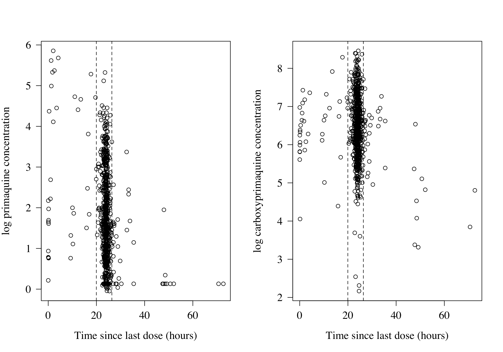
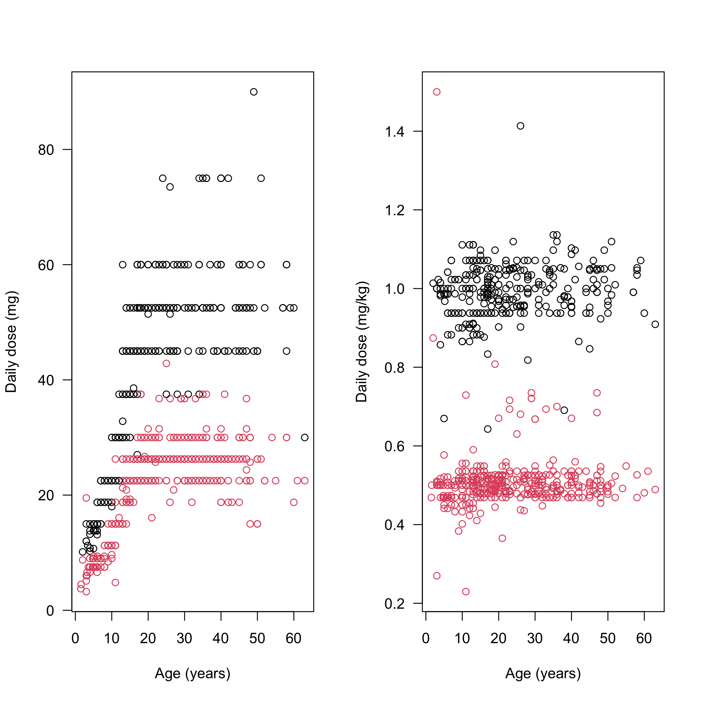
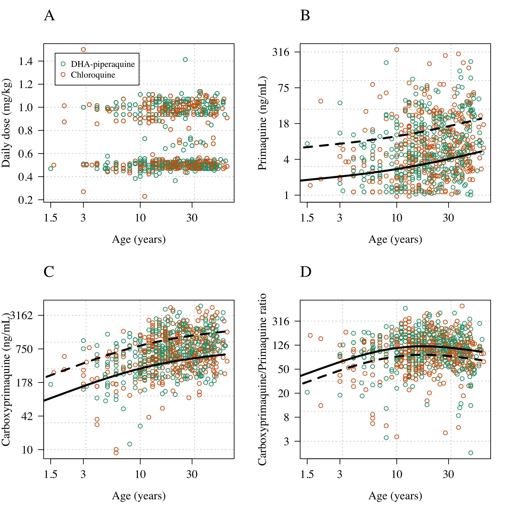
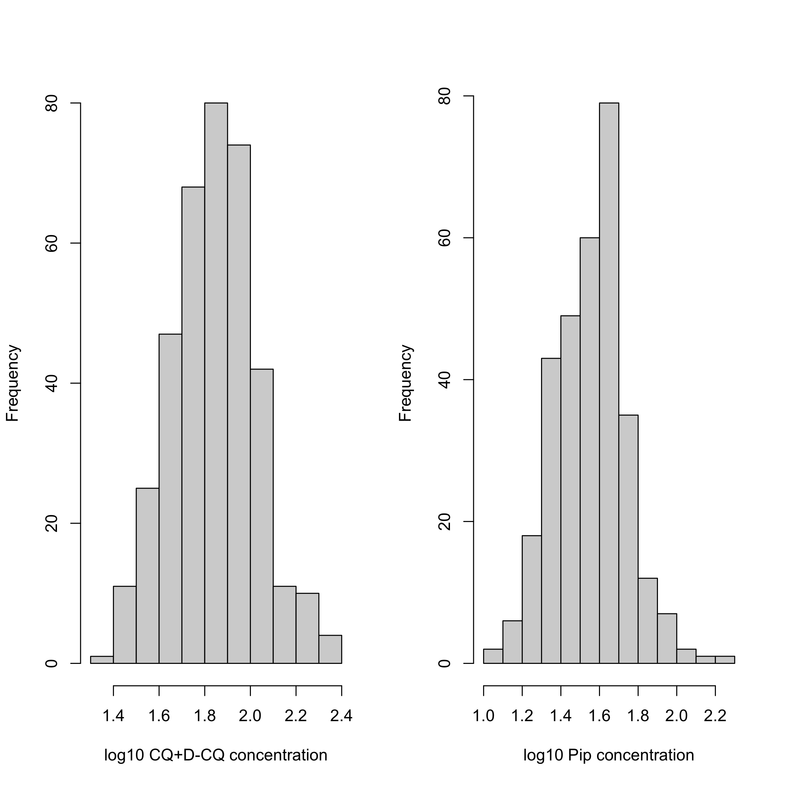
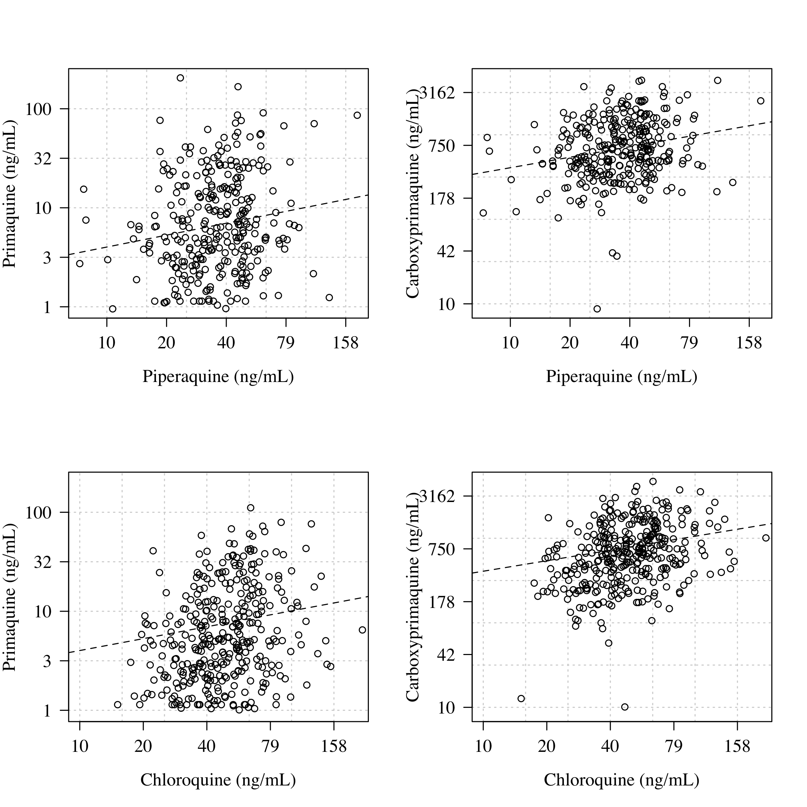
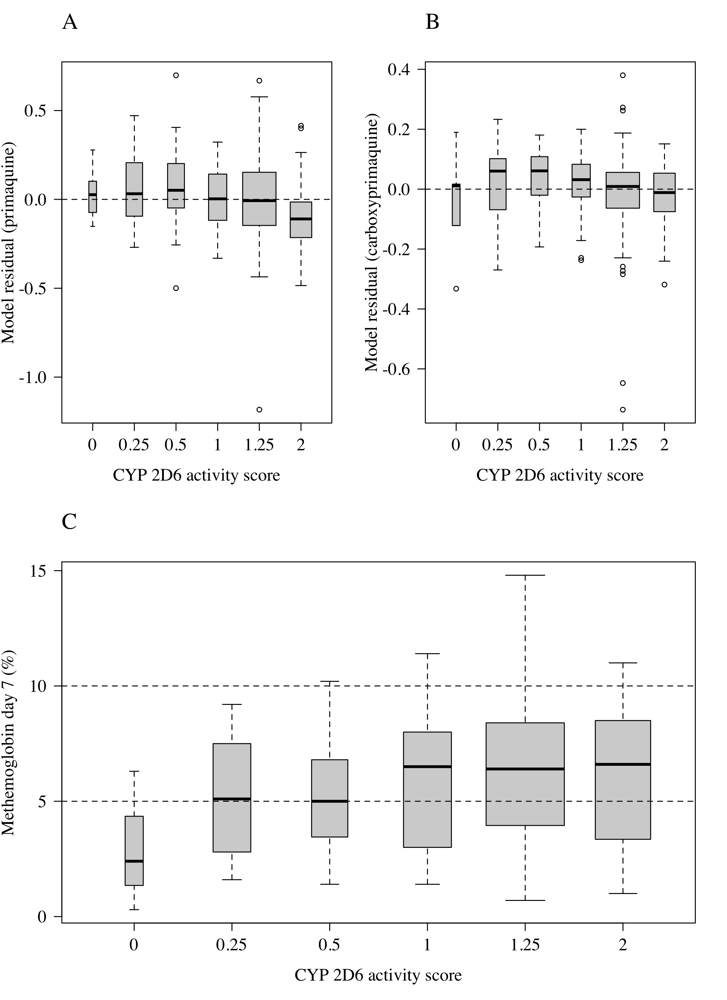
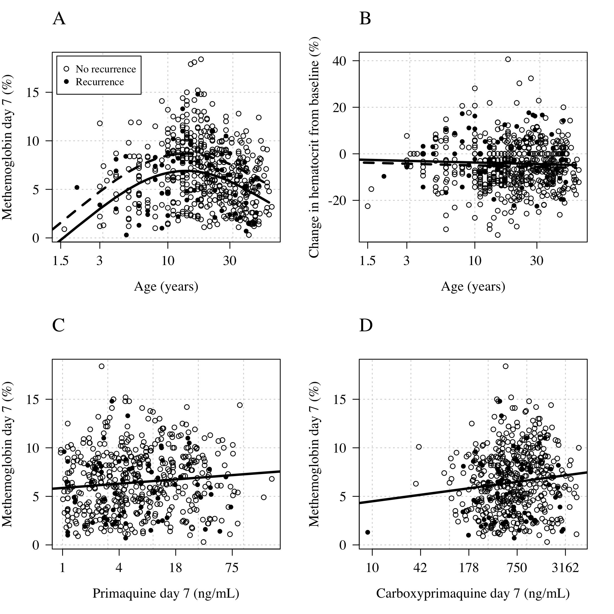
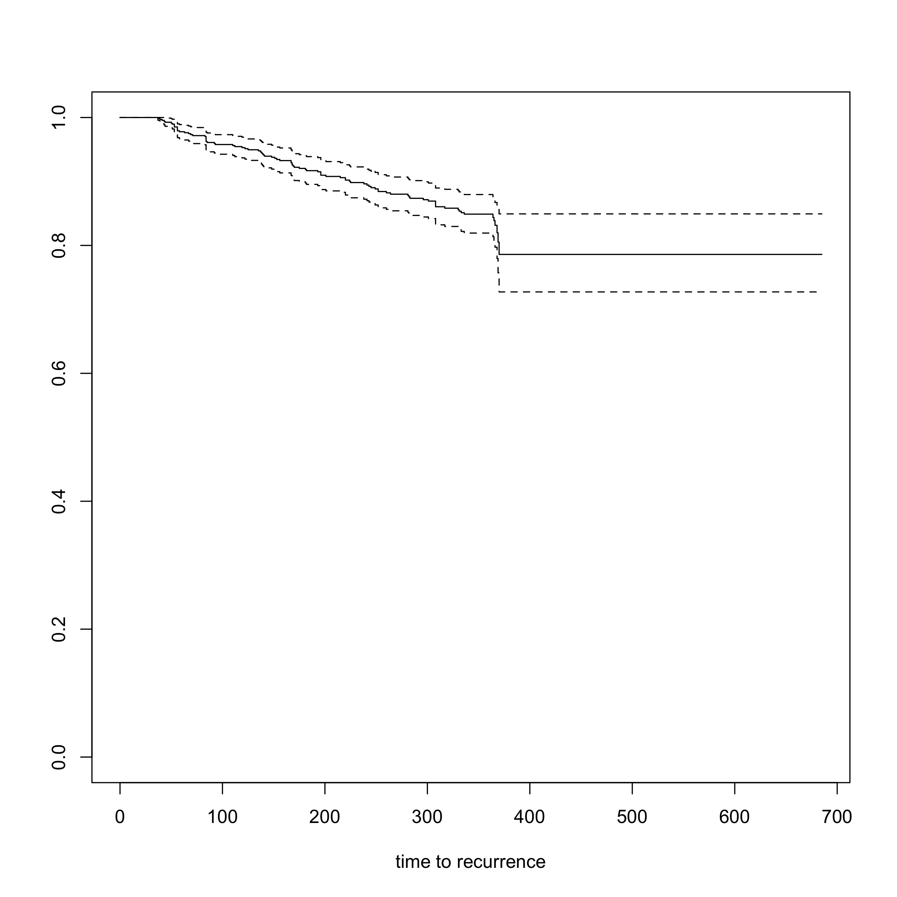
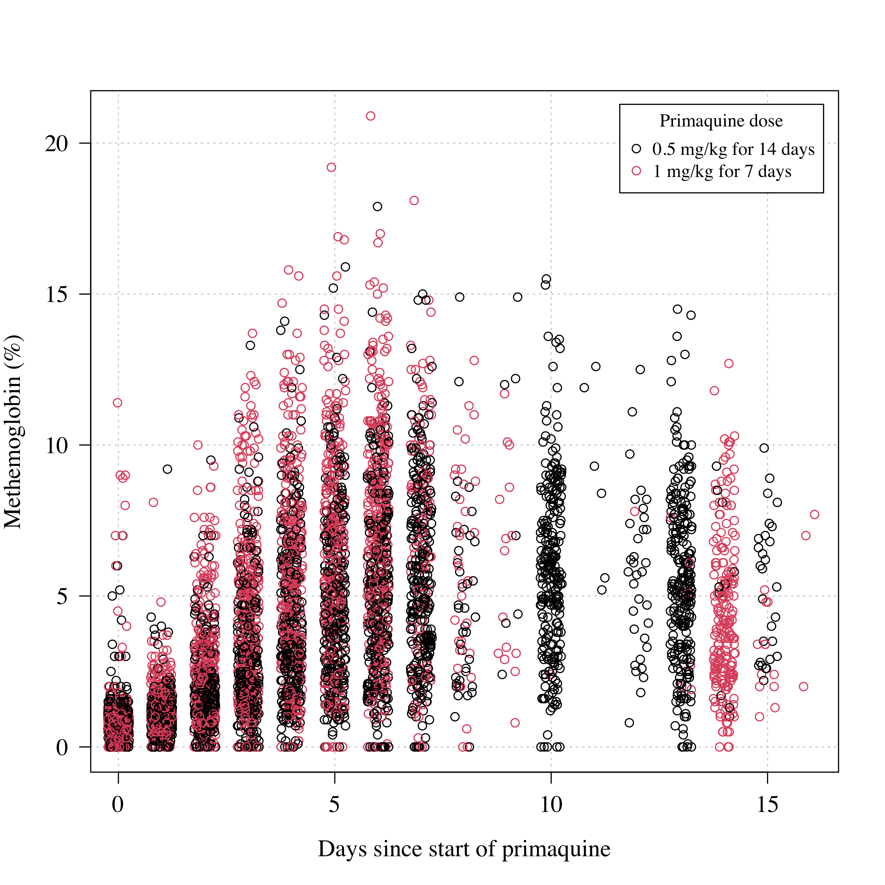
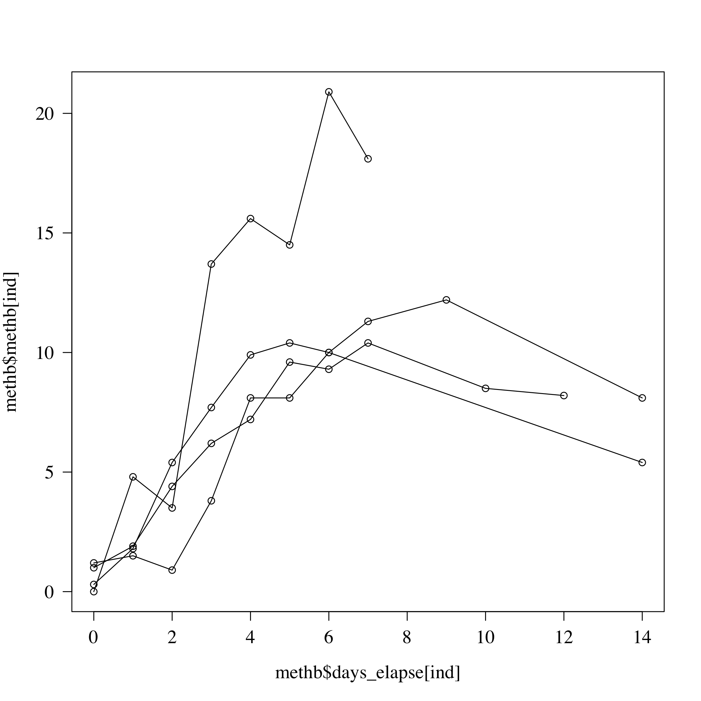

```r
library(mgcv)
```

```
## Loading required package: nlme
```

```
## This is mgcv 1.8-33. For overview type 'help("mgcv-package")'.
```

```r
library(survival)
sessionInfo()
```

```
## R version 4.0.2 (2020-06-22)
## Platform: x86_64-apple-darwin17.0 (64-bit)
## Running under: macOS  10.16
## 
## Matrix products: default
## BLAS:   /Library/Frameworks/R.framework/Versions/4.0/Resources/lib/libRblas.dylib
## LAPACK: /Library/Frameworks/R.framework/Versions/4.0/Resources/lib/libRlapack.dylib
## 
## locale:
## [1] en_GB.UTF-8/en_GB.UTF-8/en_GB.UTF-8/C/en_GB.UTF-8/en_GB.UTF-8
## 
## attached base packages:
## [1] stats     graphics  grDevices utils     datasets  methods   base     
## 
## other attached packages:
## [1] survival_3.2-7 mgcv_1.8-33    nlme_3.1-152  
## 
## loaded via a namespace (and not attached):
##  [1] lattice_0.20-41   digest_0.6.27     grid_4.0.2        magrittr_2.0.1   
##  [5] evaluate_0.14     rlang_0.4.10      stringi_1.5.3     Matrix_1.3-2     
##  [9] rmarkdown_2.6     splines_4.0.2     tools_4.0.2       stringr_1.4.0    
## [13] xfun_0.20         yaml_2.2.1        compiler_4.0.2    htmltools_0.5.1.1
## [17] knitr_1.31
```


```r
RUN_MODELS=F

pmq_PK = read.csv('BPD_curated.csv')
Combined_Time_Data = read.csv('Time_to_event.csv')
cols = RColorBrewer::brewer.pal(n = 3, name = 'Dark2')
writeLines(sprintf('There are a total of %s unique patients with data', length(unique(pmq_PK$patientid))))
```

```
## There are a total of 641 unique patients with data
```


```r
par(mfrow = c(1,2), las=1, family='serif', cex.lab=1.3, cex.axis=1.3)
plot(pmq_PK$time_since_LD, log(pmq_PK$pk_pmq),
     xlab='Time since last dose (hours)',
     ylab = 'log primaquine concentration')
abline(v=quantile(pmq_PK$time_since_LD, probs = c(0.05,.95)),lty=2)
plot(pmq_PK$time_since_LD, log(pmq_PK$pk_cpmq),
     xlab='Time since last dose (hours)',
     ylab = 'log carboxyprimaquine concentration')
abline(v=quantile(pmq_PK$time_since_LD, probs = c(0.05,.95)),lty=2)
```

<!-- -->


```r
sum(is.na(pmq_PK$pk_cpmq) & is.na(pmq_PK$pk_pmq))
```

```
## [1] 0
```

```r
sum(!is.na(pmq_PK$pk_pip) | !is.na(pmq_PK$pk_cq))
```

```
## [1] 692
```

```r
ind_rm = pmq_PK$time_since_LD>30 |
  (pmq_PK$time_since_LD>0.5 & pmq_PK$time_since_LD < 18)

writeLines(sprintf('We remove %s data points',
                   sum(ind_rm)))
```

```
## We remove 41 data points
```

```r
pmq_PK$pk_cpmq[ind_rm] = NA
pmq_PK$pk_pmq[ind_rm] = NA


writeLines(sprintf('Analysing a total of %s data points from %s patients',
                   nrow(pmq_PK), sum(!duplicated(pmq_PK$patientid))))
```

```
## Analysing a total of 720 data points from 641 patients
```

```r
print('Number of CPQ samples:')
```

```
## [1] "Number of CPQ samples:"
```

```r
sum(!is.na(pmq_PK$pk_cpmq))
```

```
## [1] 679
```

```r
print('Number of PQ samples:')
```

```
## [1] "Number of PQ samples:"
```

```r
sum(!is.na(pmq_PK$pk_pmq))
```

```
## [1] 679
```

```r
print('Number of methb samples:')
```

```
## [1] "Number of methb samples:"
```

```r
sum(!is.na(pmq_PK$methb))
```

```
## [1] 564
```

```r
print('Number of HCT samples:')
```

```
## [1] "Number of HCT samples:"
```

```r
sum(!is.na(pmq_PK$hct0))
```

```
## [1] 639
```

```r
print('Number of patients genotyped for CYP2D6:')
```

```
## [1] "Number of patients genotyped for CYP2D6:"
```

```r
sum(!is.na(pmq_PK$ASscore[!duplicated(pmq_PK$patientid)]))
```

```
## [1] 154
```


```r
par(las=1, mfrow=c(1,2))
plot(pmq_PK$age, pmq_PK$dailypmqdose,xlab='Age (years)', 
     ylab='Daily dose (mg)',
     col = pmq_PK$high_dose+1)
plot(pmq_PK$age, pmq_PK$mgkgdose,
     xlab='Age (years)', ylab='Daily dose (mg/kg)', col = pmq_PK$high_dose+1)
```

<!-- -->

```r
sum(!duplicated(pmq_PK$patientid))
```

```
## [1] 641
```

```r
table(pmq_PK$age[!duplicated(pmq_PK$patientid)]<=10)
```

```
## 
## FALSE  TRUE 
##   536   105
```

```r
table(pmq_PK$age[!duplicated(pmq_PK$patientid)]<=5)
```

```
## 
## FALSE  TRUE 
##   607    34
```

fit models

```r
pmq_PK$ratio=log10(pmq_PK$pk_cpmq)-log10(pmq_PK$pk_pmq)
pmq_PK$patientid = as.factor(pmq_PK$patientid)
if(RUN_MODELS){
  mod_ratio = gam(ratio ~ s(log10(age), k=3)+
                    mgkgdose+partner_drug+time_since_LD+daysonpq+fct+
                    s(patientid, bs = 're'), 
                  data = pmq_PK)
  mod_pmq = gam(log10(pk_pmq) ~ s(log10(age), k=3)+
                  mgkgdose+partner_drug+time_since_LD+daysonpq+fct+
                  s(patientid, bs = 're'), 
                data = pmq_PK)
  mod_cpmq = gam(log10(pk_cpmq) ~ s(log10(age), k=3)+
                   mgkgdose+partner_drug+time_since_LD+daysonpq+fct+
                   s(patientid, bs = 're'), 
                 data = pmq_PK)
  save(mod_ratio, mod_pmq, mod_cpmq, file = 'models.RData')
} else {
  load(file = 'models.RData')
}
```


```r
par(las=1, mfrow=c(2,2), family='serif', cex.lab=1.3, cex.axis=1.3)
plot(log10(pmq_PK$age), pmq_PK$mgkgdose,panel.first=grid(),
     xlab='Age (years)', ylab='Daily dose (mg/kg)',xaxt='n',
     col = cols[pmq_PK$partner_drug+1])
mtext(text = 'A', side = 3, adj = 0, line=2, cex=1.5)
axis(1, at = log10(c(1.5,3,10,30)), labels = c(1.5,3,10,30))
legend('topleft', col=cols[1:2], pch=1,
       legend = c('DHA-piperaquine','Chloroquine'), inset = 0.06)
points(log10(pmq_PK$age), pmq_PK$mgkgdose,
       col = cols[pmq_PK$partner_drug+1])

plot(log10(pmq_PK$age), log10(pmq_PK$pk_pmq), 
     col = cols[pmq_PK$partner_drug+1], xlab='Age (years)', 
     ylab = 'Primaquine (ng/mL)', yaxt='n',
     panel.first=grid(), xaxt='n')
axis(2, at = seq(0,2.5, length.out = 5), 
     labels = round(10^seq(0,2.5, length.out = 5)))
axis(1, at = log10(c(1.5,3,10,30)), labels = c(1.5,3,10,30))
mtext(text = 'B', side = 3, adj = 0, line=2, cex=1.5)

summary(mod_pmq)
```

```
## 
## Family: gaussian 
## Link function: identity 
## 
## Formula:
## log10(pk_pmq) ~ s(log10(age), k = 3) + mgkgdose + partner_drug + 
##     time_since_LD + daysonpq + fct + s(patientid, bs = "re")
## 
## Parametric coefficients:
##                Estimate Std. Error t value Pr(>|t|)    
## (Intercept)    0.287428   0.117276   2.451  0.01466 *  
## mgkgdose       1.183474   0.053212  22.241  < 2e-16 ***
## partner_drug   0.031038   0.028271   1.098  0.27288    
## time_since_LD -0.014515   0.004157  -3.492  0.00053 ***
## daysonpq      -0.016661   0.043836  -0.380  0.70407    
## fct           -0.015733   0.019277  -0.816  0.41487    
## ---
## Signif. codes:  0 '***' 0.001 '**' 0.01 '*' 0.05 '.' 0.1 ' ' 1
## 
## Approximate significance of smooth terms:
##                   edf  Ref.df     F p-value    
## s(log10(age))   1.267   1.379 42.14  <2e-16 ***
## s(patientid)  249.863 611.000  0.72  <2e-16 ***
## ---
## Signif. codes:  0 '***' 0.001 '**' 0.01 '*' 0.05 '.' 0.1 ' ' 1
## 
## R-sq.(adj) =  0.669   Deviance explained = 79.4%
## GCV = 0.12358  Scale est. = 0.076781  n = 679
```

```r
lines(log10(1:60), predict(mod_pmq,
                           data.frame(age=1:60,mgkgdose=0.5,
                                      partner_drug=1,daysonpq=1,
                                      time_since_LD=24,fct=0,
                                      patientid=0),
                           exclude = "s(patientid)"),
      lwd=3)
```

```
## Warning in predict.gam(mod_pmq, data.frame(age = 1:60, mgkgdose = 0.5,
## partner_drug = 1, : factor levels 0 not in original fit
```

```r
lines(log10(1:60), predict(mod_pmq,
                           data.frame(age=1:60,mgkgdose=1,
                                      partner_drug=1,daysonpq=1,
                                      time_since_LD=24,fct=0,
                                      patientid=0),
                           exclude = "s(patientid)"),
      lwd=3, lty=2)
```

```
## Warning in predict.gam(mod_pmq, data.frame(age = 1:60, mgkgdose = 1,
## partner_drug = 1, : factor levels 0 not in original fit
```

```r
plot(log10(pmq_PK$age), log10(pmq_PK$pk_cpmq), 
     col = cols[pmq_PK$partner_drug+1], xlab='Age (years)', 
     ylab = 'Carboxyprimaquine (ng/mL)', yaxt='n',
     panel.first=grid(), xaxt='n')
axis(2, at = seq(1,3.5, length.out = 5), 
     labels = round(10^seq(1,3.5, length.out = 5)))
axis(1, at = log10(c(1.5,3,10,30)), labels = c(1.5,3,10,30))
mtext(text = 'C', side = 3, adj = 0, line=2, cex=1.5)


summary(mod_cpmq)
```

```
## 
## Family: gaussian 
## Link function: identity 
## 
## Formula:
## log10(pk_cpmq) ~ s(log10(age), k = 3) + mgkgdose + partner_drug + 
##     time_since_LD + daysonpq + fct + s(patientid, bs = "re")
## 
## Parametric coefficients:
##                 Estimate Std. Error t value Pr(>|t|)    
## (Intercept)    2.1708363  0.0826668  26.260   <2e-16 ***
## mgkgdose       0.8587433  0.0374097  22.955   <2e-16 ***
## partner_drug  -0.0080961  0.0204532  -0.396    0.692    
## time_since_LD -0.0007441  0.0029041  -0.256    0.798    
## daysonpq       0.0442960  0.0317866   1.394    0.164    
## fct           -0.0233607  0.0139512  -1.674    0.095 .  
## ---
## Signif. codes:  0 '***' 0.001 '**' 0.01 '*' 0.05 '.' 0.1 ' ' 1
## 
## Approximate significance of smooth terms:
##                   edf  Ref.df      F p-value    
## s(log10(age))   1.901   1.939 70.037  <2e-16 ***
## s(patientid)  339.838 611.000  1.378  <2e-16 ***
## ---
## Signif. codes:  0 '***' 0.001 '**' 0.01 '*' 0.05 '.' 0.1 ' ' 1
## 
## R-sq.(adj) =  0.781   Deviance explained = 89.3%
## GCV = 0.061238  Scale est. = 0.029876  n = 679
```

```r
lines(log10(1:60), predict(mod_cpmq,
                           data.frame(age=1:60,mgkgdose=0.5,
                                      partner_drug=1,daysonpq=1,
                                      time_since_LD=24,fct=0,
                                      patientid=0),
                           exclude = "s(patientid)"),
      lwd=3)
```

```
## Warning in predict.gam(mod_cpmq, data.frame(age = 1:60, mgkgdose = 0.5, : factor
## levels 0 not in original fit
```

```r
predict(mod_cpmq, data.frame(age=c(5,30),
                             mgkgdose=0.5,
                             partner_drug=1,daysonpq=1,
                             time_since_LD=24,fct=0,
                             patientid=0),
        exclude = "s(patientid)")
```

```
## Warning in predict.gam(mod_cpmq, data.frame(age = c(5, 30), mgkgdose = 0.5, :
## factor levels 0 not in original fit
```

```
##        1        2 
## 2.349944 2.699733
```

```r
predict(mod_pmq, data.frame(age=c(5,30),
                            mgkgdose=0.5,
                            partner_drug=1,daysonpq=1,
                            time_since_LD=24,fct=0,
                            patientid=0),
        exclude = "s(patientid)")
```

```
## Warning in predict.gam(mod_pmq, data.frame(age = c(5, 30), mgkgdose = 0.5, :
## factor levels 0 not in original fit
```

```
##         1         2 
## 0.3432354 0.6160990
```

```r
lines(log10(1:60), predict(mod_cpmq,
                           data.frame(age=1:60,mgkgdose=1,
                                      partner_drug=1,daysonpq=1,
                                      time_since_LD=24,fct=0,
                                      patientid=0),
                           exclude = "s(patientid)"),
      lwd=3, lty=2)
```

```
## Warning in predict.gam(mod_cpmq, data.frame(age = 1:60, mgkgdose = 1,
## partner_drug = 1, : factor levels 0 not in original fit
```

```r
## Ratio
plot(log10(pmq_PK$age), pmq_PK$ratio,
     panel.first=grid(),yaxt='n',xaxt='n',
     xlab='Age (years)', ylab='Carboxyprimaquine/Primaquine ratio',
     col = cols[pmq_PK$partner_drug+1])
axis(2, at =  seq(0.5,2.5, length.out = 6), 
     labels = round(10^seq(0.5,2.5, length.out = 6)))
axis(1, at = log10(c(1.5,3,10,30)), labels = c(1.5,3,10,30))
mtext(text = 'D', side = 3, adj = 0,line = 2, cex=1.5)

summary(mod_ratio)
```

```
## 
## Family: gaussian 
## Link function: identity 
## 
## Formula:
## ratio ~ s(log10(age), k = 3) + mgkgdose + partner_drug + time_since_LD + 
##     daysonpq + fct + s(patientid, bs = "re")
## 
## Parametric coefficients:
##                Estimate Std. Error t value Pr(>|t|)    
## (Intercept)    1.880043   0.080193  23.444  < 2e-16 ***
## mgkgdose      -0.312100   0.036322  -8.593 2.52e-16 ***
## partner_drug  -0.040233   0.019617  -2.051   0.0410 *  
## time_since_LD  0.013531   0.002828   4.785 2.48e-06 ***
## daysonpq       0.060130   0.030466   1.974   0.0492 *  
## fct           -0.006689   0.013380  -0.500   0.6174    
## ---
## Signif. codes:  0 '***' 0.001 '**' 0.01 '*' 0.05 '.' 0.1 ' ' 1
## 
## Approximate significance of smooth terms:
##                   edf  Ref.df      F  p-value    
## s(log10(age))   1.897   1.942 10.537 3.13e-05 ***
## s(patientid)  306.070 611.000  1.087  < 2e-16 ***
## ---
## Signif. codes:  0 '***' 0.001 '**' 0.01 '*' 0.05 '.' 0.1 ' ' 1
## 
## R-sq.(adj) =  0.576   Deviance explained = 77.2%
## GCV = 0.057686  Scale est. = 0.031012  n = 679
```

```r
lines(log10(1:60), predict(mod_ratio,
                           data.frame(age=1:60,mgkgdose=0.5,
                                      partner_drug=1,daysonpq=1,
                                      time_since_LD=24,fct=0,
                                      patientid=0),
                           exclude = "s(patientid)"),
      lwd=3)
```

```
## Warning in predict.gam(mod_ratio, data.frame(age = 1:60, mgkgdose = 0.5, :
## factor levels 0 not in original fit
```

```r
lines(log10(1:60), predict(mod_ratio,
                           data.frame(age=1:60,mgkgdose=1,
                                      partner_drug=1,daysonpq=1,
                                      time_since_LD=24,fct=0,
                                      patientid=0),
                           exclude = "s(patientid)"),
      lwd=3, lty=2)
```

```
## Warning in predict.gam(mod_ratio, data.frame(age = 1:60, mgkgdose = 1,
## partner_drug = 1, : factor levels 0 not in original fit
```

<!-- -->


Numbers for precise comparisons

```r
out1=predict(mod_cpmq,data.frame(age=c(5,30),mgkgdose=1,
                                 partner_drug=1,daysonpq=1,
                                 time_since_LD=24,fct=0,
                                 patientid=0),
             exclude = "s(patientid)", se.fit = T)
```

```
## Warning in predict.gam(mod_cpmq, data.frame(age = c(5, 30), mgkgdose = 1, :
## factor levels 0 not in original fit
```

```r
10^(out1$fit[1])/10^(out1$fit[2])
```

```
##        1 
## 0.446901
```

```r
10^(out1$fit[1]+1.96*out1$se.fit[1])/10^(out1$fit[2]-1.96*out1$se.fit[2])
```

```
##         1 
## 0.5629497
```

```r
10^(out1$fit[1]-1.96*out1$se.fit[1])/10^(out1$fit[2]+1.96*out1$se.fit[2])
```

```
##        1 
## 0.354775
```

```r
out1=predict(mod_pmq,data.frame(age=c(5,30),mgkgdose=1,
                                partner_drug=1,daysonpq=1,
                                time_since_LD=24,fct=0,
                                patientid=0),
             exclude = "s(patientid)",se.fit = T)
```

```
## Warning in predict.gam(mod_pmq, data.frame(age = c(5, 30), mgkgdose = 1, :
## factor levels 0 not in original fit
```

```r
10^(out1$fit[1])/10^(out1$fit[2])
```

```
##         1 
## 0.5335025
```

```r
10^(out1$fit[1]+1.96*out1$se.fit[1])/10^(out1$fit[2]-1.96*out1$se.fit[2])
```

```
##         1 
## 0.7277651
```

```r
10^(out1$fit[1]-1.96*out1$se.fit[1])/10^(out1$fit[2]+1.96*out1$se.fit[2])
```

```
##         1 
## 0.3910945
```


```r
pmq_PK$log10_CQ[which(pmq_PK$log10_CQ<1)] = NA
pmq_PK$log10_Pip[which(pmq_PK$log10_Pip<1)] = NA

par(mfrow=c(1,2))
hist(pmq_PK$log10_CQ, xlab='log10 CQ+D-CQ concentration',main='')
hist(pmq_PK$log10_Pip, xlab='log10 Pip concentration',main='')
```

<!-- -->

```r
# effect of chloroquine
mod_pmq_CQ = gam(log10(pk_pmq) ~ s(log10(age), k=3)+
                   mgkgdose+time_since_LD+daysonpq+fct+log10_CQ+
                   s(patientid, bs = 're'), 
                 data = pmq_PK)
summary(mod_pmq_CQ)
```

```
## 
## Family: gaussian 
## Link function: identity 
## 
## Formula:
## log10(pk_pmq) ~ s(log10(age), k = 3) + mgkgdose + time_since_LD + 
##     daysonpq + fct + log10_CQ + s(patientid, bs = "re")
## 
## Parametric coefficients:
##                Estimate Std. Error t value Pr(>|t|)    
## (Intercept)   -0.158233   0.246281  -0.642 0.521158    
## mgkgdose       1.157672   0.071235  16.251  < 2e-16 ***
## time_since_LD -0.021096   0.005357  -3.938 0.000107 ***
## daysonpq      -0.128338   0.058297  -2.201 0.028640 *  
## fct            0.008520   0.022747   0.375 0.708307    
## log10_CQ       0.389914   0.107121   3.640 0.000333 ***
## ---
## Signif. codes:  0 '***' 0.001 '**' 0.01 '*' 0.05 '.' 0.1 ' ' 1
## 
## Approximate significance of smooth terms:
##                  edf  Ref.df      F  p-value    
## s(log10(age))  1.409   1.573 15.235  9.3e-05 ***
## s(patientid)  99.377 321.000  0.486 0.000119 ***
## ---
## Signif. codes:  0 '***' 0.001 '**' 0.01 '*' 0.05 '.' 0.1 ' ' 1
## 
## R-sq.(adj) =  0.642   Deviance explained =   75%
## GCV = 0.11628  Scale est. = 0.080903  n = 351
```

```r
xx = summary(mod_pmq_CQ)
10^xx$p.coeff['log10_CQ']
```

```
## log10_CQ 
## 2.454225
```

```r
round(10^(xx$p.coeff['log10_CQ'] + c(-1,1)*xx$se['log10_CQ']),1)
```

```
## [1] 1.9 3.1
```

```r
xx$p.pv['log10_CQ']
```

```
##     log10_CQ 
## 0.0003328075
```

```r
mod_cpmq_CQ = gam(log10(pk_cpmq) ~ s(log10(age), k=3)+
                    mgkgdose+time_since_LD+daysonpq+fct+log10_CQ+
                    s(patientid, bs = 're'), 
                  data = pmq_PK)
summary(mod_cpmq_CQ)
```

```
## 
## Family: gaussian 
## Link function: identity 
## 
## Formula:
## log10(pk_cpmq) ~ s(log10(age), k = 3) + mgkgdose + time_since_LD + 
##     daysonpq + fct + log10_CQ + s(patientid, bs = "re")
## 
## Parametric coefficients:
##                Estimate Std. Error t value Pr(>|t|)    
## (Intercept)    1.674585   0.183815   9.110  < 2e-16 ***
## mgkgdose       0.892973   0.053315  16.749  < 2e-16 ***
## time_since_LD -0.001427   0.004031  -0.354 0.723552    
## daysonpq      -0.043166   0.043350  -0.996 0.320285    
## fct           -0.002511   0.016918  -0.148 0.882139    
## log10_CQ       0.304724   0.079922   3.813 0.000171 ***
## ---
## Signif. codes:  0 '***' 0.001 '**' 0.01 '*' 0.05 '.' 0.1 ' ' 1
## 
## Approximate significance of smooth terms:
##                  edf  Ref.df      F p-value    
## s(log10(age))  1.914   1.972 30.926 < 2e-16 ***
## s(patientid)  79.249 321.000  0.333 0.00616 ** 
## ---
## Signif. codes:  0 '***' 0.001 '**' 0.01 '*' 0.05 '.' 0.1 ' ' 1
## 
## R-sq.(adj) =  0.649   Deviance explained = 73.5%
## GCV = 0.065182  Scale est. = 0.048996  n = 351
```

```r
xx = summary(mod_cpmq_CQ)
10^xx$p.coeff['log10_CQ']
```

```
## log10_CQ 
## 2.017085
```

```r
round(10^(xx$p.coeff['log10_CQ'] + c(-1,1)*xx$se['log10_CQ']),1)
```

```
## [1] 1.7 2.4
```

```r
xx$p.pv['log10_CQ']
```

```
##     log10_CQ 
## 0.0001711284
```

```r
mod_ratio_CQ = gam(ratio ~ s(log10(age), k=3)+
                     mgkgdose+time_since_LD+daysonpq+fct+log10_CQ+
                     s(patientid, bs = 're'), 
                   data = pmq_PK)
summary(mod_ratio_CQ)
```

```
## 
## Family: gaussian 
## Link function: identity 
## 
## Formula:
## ratio ~ s(log10(age), k = 3) + mgkgdose + time_since_LD + daysonpq + 
##     fct + log10_CQ + s(patientid, bs = "re")
## 
## Parametric coefficients:
##                Estimate Std. Error t value Pr(>|t|)    
## (Intercept)    1.858841   0.174728  10.639  < 2e-16 ***
## mgkgdose      -0.266221   0.050206  -5.303 3.05e-07 ***
## time_since_LD  0.018728   0.003708   5.051 1.00e-06 ***
## daysonpq       0.088338   0.042005   2.103   0.0367 *  
## fct           -0.009418   0.016347  -0.576   0.5652    
## log10_CQ      -0.089088   0.076220  -1.169   0.2439    
## ---
## Signif. codes:  0 '***' 0.001 '**' 0.01 '*' 0.05 '.' 0.1 ' ' 1
## 
## Approximate significance of smooth terms:
##                   edf  Ref.df     F  p-value    
## s(log10(age))   1.929   1.964 11.34 1.82e-05 ***
## s(patientid)  146.096 321.000  0.89 3.96e-07 ***
## ---
## Signif. codes:  0 '***' 0.001 '**' 0.01 '*' 0.05 '.' 0.1 ' ' 1
## 
## R-sq.(adj) =  0.555   Deviance explained =   75%
## GCV = 0.05797  Scale est. = 0.032532  n = 351
```

```r
xx = summary(mod_ratio_CQ)
10^xx$p.coeff['log10_CQ']
```

```
##  log10_CQ 
## 0.8145399
```

```r
round(10^(xx$p.coeff['log10_CQ'] + c(-1,1)*xx$se['log10_CQ']),1)
```

```
## [1] 0.7 1.0
```

```r
xx$p.pv['log10_CQ']
```

```
##  log10_CQ 
## 0.2438851
```

```r
# effect of piperaquine
mod_pmq_Pip = gam(log10(pk_pmq) ~ s(log10(age), k=3)+
                    mgkgdose+time_since_LD+daysonpq+fct+log10_Pip, 
                  data = pmq_PK)
summary(mod_pmq_Pip)
```

```
## 
## Family: gaussian 
## Link function: identity 
## 
## Formula:
## log10(pk_pmq) ~ s(log10(age), k = 3) + mgkgdose + time_since_LD + 
##     daysonpq + fct + log10_Pip
## 
## Parametric coefficients:
##                Estimate Std. Error t value Pr(>|t|)    
## (Intercept)   -0.649824   0.254894  -2.549 0.011298 *  
## mgkgdose       1.232741   0.081799  15.070  < 2e-16 ***
## time_since_LD -0.004602   0.006453  -0.713 0.476307    
## daysonpq       0.091303   0.062635   1.458 0.145991    
## fct           -0.054308   0.033125  -1.639 0.102180    
## log10_Pip      0.393370   0.111457   3.529 0.000483 ***
## ---
## Signif. codes:  0 '***' 0.001 '**' 0.01 '*' 0.05 '.' 0.1 ' ' 1
## 
## Approximate significance of smooth terms:
##                 edf Ref.df     F  p-value    
## s(log10(age)) 1.526  1.775 13.88 6.62e-05 ***
## ---
## Signif. codes:  0 '***' 0.001 '**' 0.01 '*' 0.05 '.' 0.1 ' ' 1
## 
## R-sq.(adj) =  0.473   Deviance explained = 48.5%
## GCV = 0.13152  Scale est. = 0.12824   n = 302
```

```r
xx = summary(mod_pmq_Pip)
10^xx$p.coeff['log10_Pip']
```

```
## log10_Pip 
##  2.473833
```

```r
round(10^(xx$p.coeff['log10_Pip'] + c(-1,1)*xx$se['log10_Pip']),1)
```

```
## [1] 1.9 3.2
```

```r
xx$p.pv['log10_Pip']
```

```
##    log10_Pip 
## 0.0004831835
```

```r
mod_cpmq_Pip = gam(log10(pk_cpmq) ~ s(log10(age), k=3)+
                     mgkgdose+time_since_LD+daysonpq+fct+log10_Pip, 
                   data = pmq_PK)
summary(mod_cpmq_Pip)
```

```
## 
## Family: gaussian 
## Link function: identity 
## 
## Formula:
## log10(pk_cpmq) ~ s(log10(age), k = 3) + mgkgdose + time_since_LD + 
##     daysonpq + fct + log10_Pip
## 
## Parametric coefficients:
##                Estimate Std. Error t value Pr(>|t|)    
## (Intercept)    1.427916   0.177106   8.063 1.89e-14 ***
## mgkgdose       0.851271   0.056835  14.978  < 2e-16 ***
## time_since_LD  0.001344   0.004484   0.300  0.76452    
## daysonpq       0.125380   0.043521   2.881  0.00426 ** 
## fct           -0.057687   0.023016  -2.506  0.01274 *  
## log10_Pip      0.405289   0.077438   5.234 3.16e-07 ***
## ---
## Signif. codes:  0 '***' 0.001 '**' 0.01 '*' 0.05 '.' 0.1 ' ' 1
## 
## Approximate significance of smooth terms:
##                 edf Ref.df     F p-value    
## s(log10(age)) 1.501  1.751 32.78  <2e-16 ***
## ---
## Signif. codes:  0 '***' 0.001 '**' 0.01 '*' 0.05 '.' 0.1 ' ' 1
## 
## R-sq.(adj) =  0.537   Deviance explained = 54.7%
## GCV = 0.063492  Scale est. = 0.061915  n = 302
```

```r
xx = summary(mod_cpmq_Pip)
10^xx$p.coeff['log10_Pip']
```

```
## log10_Pip 
##  2.542666
```

```r
round(10^(xx$p.coeff['log10_Pip'] + c(-1,1)*xx$se['log10_Pip']),1)
```

```
## [1] 2.1 3.0
```

```r
xx$p.pv['log10_Pip']
```

```
##    log10_Pip 
## 3.162512e-07
```

```r
mod_ratio_Pip = gam(ratio ~ s(log10(age), k=3)+
                      mgkgdose+time_since_LD+daysonpq+fct+log10_Pip, 
                    data = pmq_PK)
summary(mod_ratio_Pip)
```

```
## 
## Family: gaussian 
## Link function: identity 
## 
## Formula:
## ratio ~ s(log10(age), k = 3) + mgkgdose + time_since_LD + daysonpq + 
##     fct + log10_Pip
## 
## Parametric coefficients:
##                Estimate Std. Error t value Pr(>|t|)    
## (Intercept)    2.088594   0.180983  11.540  < 2e-16 ***
## mgkgdose      -0.385060   0.058081  -6.630 1.61e-10 ***
## time_since_LD  0.006249   0.004582   1.364    0.174    
## daysonpq       0.033378   0.044457   0.751    0.453    
## fct           -0.004946   0.023522  -0.210    0.834    
## log10_Pip      0.003023   0.079212   0.038    0.970    
## ---
## Signif. codes:  0 '***' 0.001 '**' 0.01 '*' 0.05 '.' 0.1 ' ' 1
## 
## Approximate significance of smooth terms:
##                 edf Ref.df     F p-value   
## s(log10(age)) 1.915  1.993 5.922 0.00255 **
## ---
## Signif. codes:  0 '***' 0.001 '**' 0.01 '*' 0.05 '.' 0.1 ' ' 1
## 
## R-sq.(adj) =  0.142   Deviance explained = 16.1%
## GCV = 0.066343  Scale est. = 0.064604  n = 302
```


Supplementary Figure

```r
par(las=1, mfrow=c(2,2), family='serif', cex.lab=1.3, cex.axis=1.3)
plot(log10(pmq_PK$pk_pip), log10(pmq_PK$pk_pmq),
     ylab = 'Primaquine (ng/mL)', yaxt='n',
     panel.first=grid(), yaxt='n',xaxt='n',
     xlab = 'Piperaquine (ng/mL)')
axis(2, at = seq(0,2.0, length.out = 5), 
     labels = round(10^seq(0,2, length.out = 5)))
axis(1, at = seq(1,2.2, length.out = 5), 
     labels = round(10^seq(1,2.2, length.out = 5)))
abline(MASS::rlm(log10(pmq_PK$pk_pmq)~log10(pmq_PK$pk_pip)),lty=2)

plot(log10(pmq_PK$pk_pip), log10(pmq_PK$pk_cpmq),
     ylab = 'Carboxyprimaquine (ng/mL)', yaxt='n',
     panel.first=grid(), yaxt='n',xaxt='n',
     xlab = 'Piperaquine (ng/mL)')
axis(2, at = seq(1,3.5, length.out = 5), 
     labels = round(10^seq(1,3.5, length.out = 5)))
axis(1, at = seq(1,2.2, length.out = 5), 
     labels = round(10^seq(1,2.2, length.out = 5)))
abline(MASS::rlm(log10(pmq_PK$pk_cpmq)~log10(pmq_PK$pk_pip)),lty=2)

plot(log10(pmq_PK$pk_cq), log10(pmq_PK$pk_pmq),
     ylab = 'Primaquine (ng/mL)', yaxt='n',
     panel.first=grid(), yaxt='n',xaxt='n',
     xlab = 'Chloroquine (ng/mL)',xlim=c(1,2.31))
axis(2, at = seq(0,2.0, length.out = 5), 
     labels = round(10^seq(0,2, length.out = 5)))
axis(1, at = seq(1,2.2, length.out = 5), 
     labels = round(10^seq(1,2.2, length.out = 5)))
abline(MASS::rlm(log10(pmq_PK$pk_pmq)~log10(pmq_PK$pk_pip)),lty=2)

plot(log10(pmq_PK$pk_cq), log10(pmq_PK$pk_cpmq),
     ylab = 'Carboxyprimaquine (ng/mL)', yaxt='n',
     panel.first=grid(), yaxt='n',xaxt='n',
     xlab = 'Chloroquine (ng/mL)',xlim=c(1,2.31))
axis(2, at = seq(1,3.5, length.out = 5), 
     labels = round(10^seq(1,3.5, length.out = 5)))
axis(1, at = seq(1,2.2, length.out = 5), 
     labels = round(10^seq(1,2.2, length.out = 5)))
abline(MASS::rlm(log10(pmq_PK$pk_cpmq)~log10(pmq_PK$pk_pip)),lty=2)
```

<!-- -->


## Figure 2

Plot against residuals******

```r
ind = !is.na(pmq_PK$ASscore)
sum(!duplicated(pmq_PK$patientid) & ind)
```

```
## [1] 154
```

```r
table(pmq_PK$ASscore[!duplicated(pmq_PK$patientid)])
```

```
## 
##    0 0.25  0.5    1 1.25    2 
##    3   19   17   22   64   29
```

```r
pmq_PK$pred_pmq[!is.na(pmq_PK$pk_pmq)] = predict(mod_pmq)
pmq_PK$res_pmq = log10(pmq_PK$pk_pmq)-pmq_PK$pred_pmq

pmq_PK$pred_cpmq[!is.na(pmq_PK$pk_cpmq)] = predict(mod_cpmq)
pmq_PK$res_cpmq = log10(pmq_PK$pk_cpmq)-pmq_PK$pred_cpmq

par(mfrow=c(2,2), las=1, family='serif', 
    cex.axis=1.4, cex.lab=1.4)
layout(mat = matrix(data = c(1,2,3,3),nrow = 2,byrow = T))
boxplot(pmq_PK$res_pmq~pmq_PK$ASscore, 
        xlab='CYP 2D6 activity score',
        varwidth=T,
        ylab='Model residual (primaquine)')
abline(h=0, lty=2, lwd=1)
cor.test(pmq_PK$res_pmq,pmq_PK$ASscore)
```

```
## 
## 	Pearson's product-moment correlation
## 
## data:  pmq_PK$res_pmq and pmq_PK$ASscore
## t = -2.9531, df = 211, p-value = 0.003502
## alternative hypothesis: true correlation is not equal to 0
## 95 percent confidence interval:
##  -0.32495354 -0.06657622
## sample estimates:
##        cor 
## -0.1992248
```

```r
mtext(text = 'A', side = 3, adj = 0,line = 2, cex=1.5)

boxplot(pmq_PK$res_cpmq~pmq_PK$ASscore, 
        xlab='CYP 2D6 activity score',
        varwidth=T,
        ylab='Model residual (carboxyprimaquine)')
abline(h=0, lty=2, lwd=1)
# abline(modAS_res_cpmq,lwd=3)
cor.test(pmq_PK$res_cpmq,pmq_PK$ASscore)
```

```
## 
## 	Pearson's product-moment correlation
## 
## data:  pmq_PK$res_cpmq and pmq_PK$ASscore
## t = -1.536, df = 211, p-value = 0.126
## alternative hypothesis: true correlation is not equal to 0
## 95 percent confidence interval:
##  -0.23624605  0.02969749
## sample estimates:
##       cor 
## -0.105154
```

```r
mtext(text = 'B', side = 3, adj = 0,line = 2, cex=1.5)

boxplot(pmq_PK$methb ~ pmq_PK$ASscore,
        xlab='CYP 2D6 activity score',
        varwidth=T,
        ylab='Methemoglobin day 7 (%)')
abline(h= c(5,10), lty=2, lwd=1)
modAS_methb = lm(methb ~ ASscore,data = pmq_PK)
cor.test(pmq_PK$methb,as.numeric(pmq_PK$ASscore <1))
```

```
## 
## 	Pearson's product-moment correlation
## 
## data:  pmq_PK$methb and as.numeric(pmq_PK$ASscore < 1)
## t = -2.0012, df = 131, p-value = 0.04744
## alternative hypothesis: true correlation is not equal to 0
## 95 percent confidence interval:
##  -0.332703269 -0.002064506
## sample estimates:
##        cor 
## -0.1722308
```

```r
mtext(text = 'C', side = 3, adj = 0,line = 2, cex=1.5)
```

<!-- -->


## Met-Hb versus age


```r
mod_methb = gam(methb ~ s(log10(age),k=3)+
                  mgkgdose+daysonpq+G6PDdef, 
                data = pmq_PK)
xx=summary(mod_methb)
xx$s.pv
```

```
## [1] 0
```

```r
out1=predict(mod_methb,data.frame(age=c(5,30),mgkgdose=1,
                                  G6PDdef=1,
                                  daysonpq=1,patientid=0),
             exclude = "s(patientid)",se.fit = T)
(out1$fit[1])/(out1$fit[2])
```

```
##         1 
## 0.8782454
```

```r
(out1$fit[1]+1.96*out1$se.fit[1])/(out1$fit[2]-1.96*out1$se.fit[2])
```

```
##        1 
## 1.283492
```

```r
(out1$fit[1]-1.96*out1$se.fit[1])/(out1$fit[2]+1.96*out1$se.fit[2])
```

```
##         1 
## 0.5908408
```

```r
mod_methb2 = gam(methb ~ s(log10(age), k=3)+
                   mgkgdose+daysonpq+ASscore+G6PDdef, 
                 data = pmq_PK)
summary(mod_methb2)
```

```
## 
## Family: gaussian 
## Link function: identity 
## 
## Formula:
## methb ~ s(log10(age), k = 3) + mgkgdose + daysonpq + ASscore + 
##     G6PDdef
## 
## Parametric coefficients:
##             Estimate Std. Error t value Pr(>|t|)    
## (Intercept)   4.1867     1.3424   3.119 0.002250 ** 
## mgkgdose      3.1357     0.9173   3.419 0.000849 ***
## daysonpq     -1.1144     0.7657  -1.456 0.148008    
## ASscore       0.6595     0.4367   1.510 0.133495    
## G6PDdef      -0.7631     0.8712  -0.876 0.382736    
## ---
## Signif. codes:  0 '***' 0.001 '**' 0.01 '*' 0.05 '.' 0.1 ' ' 1
## 
## Approximate significance of smooth terms:
##                 edf Ref.df    F  p-value    
## s(log10(age)) 1.947  1.997 9.05 0.000216 ***
## ---
## Signif. codes:  0 '***' 0.001 '**' 0.01 '*' 0.05 '.' 0.1 ' ' 1
## 
## R-sq.(adj) =  0.202   Deviance explained = 23.8%
## GCV = 7.7766  Scale est. = 7.3703    n = 133
```

```r
mod_methb3 = gam(methb ~ s(log10(age), k=3)+
                   mgkgdose+as.numeric(ASscore<=0.5)+G6PDdef, 
                 data = pmq_PK)
summary(mod_methb3)
```

```
## 
## Family: gaussian 
## Link function: identity 
## 
## Formula:
## methb ~ s(log10(age), k = 3) + mgkgdose + as.numeric(ASscore <= 
##     0.5) + G6PDdef
## 
## Parametric coefficients:
##                            Estimate Std. Error t value Pr(>|t|)    
## (Intercept)                  3.7161     0.7212   5.152 9.56e-07 ***
## mgkgdose                     3.4396     0.9164   3.754 0.000264 ***
## as.numeric(ASscore <= 0.5)  -1.2093     0.5855  -2.065 0.040923 *  
## G6PDdef                     -0.4339     0.8574  -0.506 0.613664    
## ---
## Signif. codes:  0 '***' 0.001 '**' 0.01 '*' 0.05 '.' 0.1 ' ' 1
## 
## Approximate significance of smooth terms:
##                 edf Ref.df     F  p-value    
## s(log10(age)) 1.943  1.997 8.346 0.000448 ***
## ---
## Signif. codes:  0 '***' 0.001 '**' 0.01 '*' 0.05 '.' 0.1 ' ' 1
## 
## R-sq.(adj) =  0.202   Deviance explained = 23.2%
## GCV = 7.7081  Scale est. = 7.3637    n = 133
```

```r
which.max(pmq_PK$methb>20)
```

```
## [1] 1
```


Hb fall

```r
pmq_PK$hct_delta = -100*(pmq_PK$hct0 - pmq_PK$hct7)/pmq_PK$hct0
mod_hct_delta = gam(hct_delta ~ s(log10(age),k=3)+
                      mgkgdose+partner_drug+daysonpq+fct+G6PDdef, 
                    data = pmq_PK[pmq_PK$episode==1, ])
summary(mod_hct_delta)
```

```
## 
## Family: gaussian 
## Link function: identity 
## 
## Formula:
## hct_delta ~ s(log10(age), k = 3) + mgkgdose + partner_drug + 
##     daysonpq + fct + G6PDdef
## 
## Parametric coefficients:
##              Estimate Std. Error t value Pr(>|t|)    
## (Intercept)   -3.0153     1.6916  -1.782  0.07515 .  
## mgkgdose      -2.4521     1.4313  -1.713  0.08717 .  
## partner_drug  -2.9879     0.7301  -4.092 4.83e-05 ***
## daysonpq       3.0930     1.1167   2.770  0.00577 ** 
## fct           -2.1301     0.4992  -4.267 2.28e-05 ***
## G6PDdef      -12.0326     1.6689  -7.210 1.60e-12 ***
## ---
## Signif. codes:  0 '***' 0.001 '**' 0.01 '*' 0.05 '.' 0.1 ' ' 1
## 
## Approximate significance of smooth terms:
##               edf Ref.df     F p-value
## s(log10(age))   1      1 1.205   0.273
## 
## R-sq.(adj) =   0.12   Deviance explained = 12.8%
## GCV = 85.072  Scale est. = 84.14     n = 639
```


Figure 3


```r
ids_recurrence = unique(Combined_Time_Data$patientid[Combined_Time_Data$Censored==1])
pmq_PK$recurrence = 1
pmq_PK$recurrence[pmq_PK$patientid %in% ids_recurrence]=16
par(las=1, mfrow=c(2,2), family='serif', 
    cex.axis=1.3, cex.lab=1.3)
plot(log10(pmq_PK$age), pmq_PK$methb,
     xlab='Age (years)', 
     ylab = 'Methemoglobin day 7 (%)',
     panel.first=grid(), xaxt='n',pch=pmq_PK$recurrence)
axis(1, at = log10(c(1.5,3,10,30)), labels = c(1.5,3,10,30))
lines(log10(1:60), predict(mod_methb,
                           data.frame(age=1:60,mgkgdose=0.5,daysonpq=1,
                                      G6PDdef=0)),
      lwd=3)
lines(log10(1:60), predict(mod_methb,
                           data.frame(age=1:60,mgkgdose=1,daysonpq=1,
                                      G6PDdef=0)),
      lwd=3,lty=2)
ind_PM = which(pmq_PK$ASscore<=0.5)

mtext(text = 'A', side = 3, adj = 0,line = 2, cex=1.5)
legend('topleft', pch=c(1,16),
       legend = c('No recurrence','Recurrence'), inset = 0.02)


plot(log10(pmq_PK$age), pmq_PK$hct_delta,
     xlab='Age (years)', 
     ylab = 'Change in hematocrit from baseline (%)',
     panel.first=grid(), xaxt='n',pch=pmq_PK$recurrence)
axis(1, at = log10(c(1.5,3,10,30)), labels = c(1.5,3,10,30))
lines(log10(1:60), predict(mod_hct_delta,
                           data.frame(age=1:60,mgkgdose=0.5,
                                      partner_drug=1,daysonpq=1,
                                      fct=0,G6PDdef=0)),
      lwd=3)
lines(log10(1:60), predict(mod_hct_delta,
                           data.frame(age=1:60,mgkgdose=1,
                                      partner_drug=1,daysonpq=1,
                                      fct=0,G6PDdef=0)),
      lwd=3,lty=2)
mtext(text = 'B', side = 3, adj = 0,line = 2, cex=1.5)

plot(log10(pmq_PK$pk_pmq), pmq_PK$methb,
     xlab='Primaquine day 7 (ng/mL)', 
     ylab = 'Methemoglobin day 7 (%)',
     panel.first=grid(), xaxt='n',pch=pmq_PK$recurrence)
m1=MASS::rlm(pmq_PK$methb~log10(pmq_PK$pk_pmq))
summary(m1)
```

```
## 
## Call: rlm(formula = pmq_PK$methb ~ log10(pmq_PK$pk_pmq))
## Residuals:
##      Min       1Q   Median       3Q      Max 
## -6.66454 -2.32696  0.02834  2.28972 12.23003 
## 
## Coefficients:
##                      Value   Std. Error t value
## (Intercept)           5.8656  0.2798    20.9613
## log10(pmq_PK$pk_pmq)  0.7056  0.2956     2.3872
## 
## Residual standard error: 3.422 on 536 degrees of freedom
##   (182 observations deleted due to missingness)
```

```r
abline(m1,lwd=3)
axis(1, at = seq(0,2.5, length.out = 5), 
     labels = round(10^seq(0,2.5, length.out = 5)))
mtext(text = 'C', side = 3, adj = 0,line = 2, cex=1.5)

plot(log10(pmq_PK$pk_cpmq), pmq_PK$methb,
     xlab='Carboxyprimaquine day 7 (ng/mL)', 
     ylab = 'Methemoglobin day 7 (%)',
     panel.first=grid(), xaxt='n',pch=pmq_PK$recurrence)
m2=MASS::rlm(pmq_PK$methb~log10(pmq_PK$pk_cpmq))
summary(m2)
```

```
## 
## Call: rlm(formula = pmq_PK$methb ~ log10(pmq_PK$pk_cpmq))
## Residuals:
##      Min       1Q   Median       3Q      Max 
## -6.61372 -2.29846  0.03574  2.32747 12.06023 
## 
## Coefficients:
##                       Value  Std. Error t value
## (Intercept)           3.4238 1.1301     3.0297 
## log10(pmq_PK$pk_cpmq) 1.0697 0.3970     2.6944 
## 
## Residual standard error: 3.422 on 536 degrees of freedom
##   (182 observations deleted due to missingness)
```

```r
abline(m2,lwd=3)
axis(1, at = seq(1,3.5, length.out = 5), 
     labels = round(10^seq(1,3.5, length.out = 5)))
mtext(text = 'D', side = 3, adj = 0,line = 2, cex=1.5)
```

<!-- -->


## Recurrence data


```r
km_fit = survfit(Surv(Time_to_event, Censored) ~ 1, data=Combined_Time_Data)
plot(km_fit, xlab='time to recurrence')
```

<!-- -->

```r
Combined_Time_Data = Combined_Time_Data[Combined_Time_Data$episode==1 &
                                          !is.na(Combined_Time_Data$CPQ), ]
cox_mod0 <- coxph(Surv(Time_to_event, Censored) ~ PMQ_partner + log10(age) +
                    log10(CPQ)*high_dose_PMQ-high_dose_PMQ, 
                  data = Combined_Time_Data)
summary(cox_mod0)$coefficients
```

```
##                                 coef exp(coef)  se(coef)           z  Pr(>|z|)
## PMQ_partnerDP            -0.19655472 0.8215564 0.2278102 -0.86280032 0.3882473
## log10(age)               -0.40439215 0.6673824 0.3979696 -1.01613833 0.3095635
## log10(CPQ)               -0.03070572 0.9697609 0.3823314 -0.08031181 0.9359893
## log10(CPQ):high_dose_PMQ  0.05504329 1.0565863 0.1015922  0.54180632 0.5879519
```

```r
cox_mod1 <- coxph(Surv(Time_to_event, Censored) ~ PMQ_partner + log10(age) +
                    log10(PQ)*high_dose_PMQ-high_dose_PMQ + methb, 
                  data = Combined_Time_Data)
summary(cox_mod1)$coefficients
```

```
##                                coef exp(coef)   se(coef)          z   Pr(>|z|)
## PMQ_partnerDP           -0.26282428 0.7688770 0.24395288 -1.0773568 0.28132092
## log10(age)              -0.68007709 0.5065779 0.36546030 -1.8608782 0.06276139
## log10(PQ)                0.19534775 1.2157337 0.23069173  0.8467913 0.39711145
## methb                   -0.08612799 0.9174768 0.03915236 -2.1998160 0.02781995
## log10(PQ):high_dose_PMQ  0.30938721 1.3625899 0.27058369  1.1434067 0.25286975
```

```r
cox_mod2 <- coxph(Surv(Time_to_event, Censored) ~ PMQ_partner + log10(age) +
                    log10(CPQ)*high_dose_PMQ-high_dose_PMQ + methb, 
                  data = Combined_Time_Data)
summary(cox_mod2)$coefficients
```

```
##                                  coef exp(coef)   se(coef)           z
## PMQ_partnerDP            -0.230046011 0.7944970 0.24337449 -0.94523469
## log10(age)               -0.551662743 0.5759913 0.40948726 -1.34720368
## log10(CPQ)                0.004352473 1.0043620 0.39765633  0.01094531
## methb                    -0.090090056 0.9138489 0.03931755 -2.29134440
## log10(CPQ):high_dose_PMQ -0.026136071 0.9742025 0.11228587 -0.23276367
##                           Pr(>|z|)
## PMQ_partnerDP            0.3445391
## log10(age)               0.1779146
## log10(CPQ)               0.9912671
## methb                    0.0219435
## log10(CPQ):high_dose_PMQ 0.8159449
```


## Supplementary Figures


```r
methb=haven::read_dta('../../Genotyping/Data/PK data/Methb_for James_21Jun.dta')
methb$Visit_ID = apply(methb[, c('patientid','episode','days_elapse')],1,function(x)
  paste(x[1], x[2], x[3], sep='_'))

length(unique(methb$Visit_ID))
```

```
## [1] 15717
```

```r
methb = methb[!duplicated(methb$Visit_ID), ]
methb = methb[!is.na(methb$methb),]

table(methb$days_elapse)
```

```
## 
##   0   1   2   3   4   5   6   7   8   9  10  11  12  13  14  15  16  17  18  23 
## 577 566 568 574 566 562 576 397  73  22 253   6  35 252 209  40   3   5   4   1 
##  28  35  38 
##   3   1   1
```

```r
par(las=1, mfrow=c(1,1), family='serif', cex.axis=1.3, cex.lab=1.3)
ind1=methb$patientid %in% pmq_PK$patientid[pmq_PK$high_dose==0]
methb$high_dose = as.numeric(ind1)
plot(jitter(methb$days_elapse,amount = 0.25), 
     methb$methb, xlim = c(0, 16),
     xlab='Days since start of primaquine', 
     ylab = 'Methemoglobin (%)',
     col = methb$high_dose+1, panel.first=grid())
legend('topright', col = 1:2, 
       legend = c('0.5 mg/kg for 14 days',
                  '1 mg/kg for 7 days'),
       pch = 1, title = 'Primaquine dose',inset=0.02)
```

<!-- -->

```r
special_ids = c(198,301,379,678)
ind = methb$patientid %in% special_ids
plot(methb$days_elapse[ind], methb$methb[ind])
for(id in special_ids){
  ind = methb$patientid ==id
  lines(methb$days_elapse[ind], methb$methb[ind])
  print(methb$methb[ind])
}
```

<!-- -->

```
##  [1]  1.0  1.9  4.4  6.2  7.2  9.6  9.3 10.4  8.5  8.2
##  [1]  1.2  1.5  0.9  3.8  8.1  8.1 10.0 11.3 12.2  8.1
## [1]  0.3  1.8  5.4  7.7  9.9 10.4 10.0  5.4
## [1]  0.0  4.8  3.5 13.7 15.6 14.5 20.9 18.1
```

```r
pmq_PK$pk_cpmq[pmq_PK$patientid %in% special_ids]
```

```
## [1]  218 1820   NA   NA
```

```r
pmq_PK$pk_pmq[pmq_PK$patientid %in% special_ids]
```

```
## [1]  2.59 20.30    NA    NA
```


